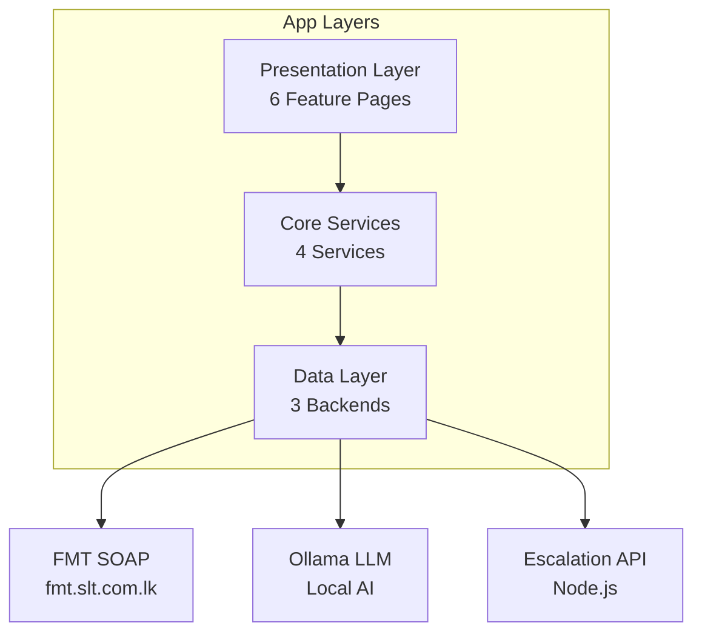

# SLT NOC Portal - Documentation Index

> **Sri Lanka Telecom Network Operations Center Mobile Application**  
> Flutter 3.x | Dart | Android/iOS

---

## 📚 Documentation Structure

| Document | Description | Key Diagrams |
|----------|-------------|--------------|
| [`architecture.md`](architecture.md) | System architecture, design patterns, security, dependencies, build config | System Arch, Repository Pattern, Factory Pattern, SSL Pinning, Dependency Graph |
| [`dataflow.md`](dataflow.md) | Complete data flows for all modules | Auth, Home Dashboard, Alarms, Clarity, Escalations, AI Chat, Background Services, Fallback URLs, Persistence Schema, Error Handling |
| [`modules.md`](modules.md) | Module structure, file hierarchy, responsibilities | Directory Layout, Alarms Hierarchy, Clarity Hierarchy, Escalations Hierarchy, AI Chat Components, Module Dependencies |
| [`api.md`](api.md) | API integration details for all backends | FMT SOAP (11 endpoints), Ollama SSE, Escalation REST, Network Layer, Versioning |
| [`features.md`](features.md) | Feature deep-dives with implementation details | Login, Alarm Map, Clarity OSS, Escalations, AI Chat (Streaming, Speech, Markdown), GPS, Notifications |

---

## 🏗️ Quick Architecture Overview



---

## 🚀 Quick Start

### Prerequisites
- Flutter SDK 3.x
- Dart 3.x
- Android Studio / Xcode
- Access to FMT SOAP API (`fmt.slt.com.lk`)
- Ollama server running (default `192.168.1.8:3000`)
- Manual Escalation API server (same host as Ollama)

### Build Commands
```bash
# Get dependencies
flutter pub get

# Generate app icons
dart run flutter_launcher_icons:main

# Build APK with custom API URL
flutter build apk --dart-define=MANUAL_ESCALATION_API_BASE_URL=http://your-server:3000

# Build iOS
flutter build ios --dart-define=MANUAL_ESCALATION_API_BASE_URL=http://your-server:3000

# Run in debug
flutter run
```

### Assets Required
```
assets/
├── certs/
│   └── slt_ca.crt          # SSL cert for FMT pinning
├── NOCPORTAL.jpg           # App icon source
├── NEW.png                 # Adaptive icon foreground
├── ai.jpg                  # AI chat background
├── home.png                # Home background
├── map_marker_*.png        # Custom map markers
└── ...
```

---

## 🔑 Key Technical Decisions

| Area | Decision | Rationale |
|------|----------|-----------|
| **State Management** | Provider-less (`setState` + `SharedPreferences` + `Timer`) | Simple, no extra dependencies, sufficient for current scope |
| **Network** | Custom HTTP factory with SSL pinning for FMT | Enterprise security requirement |
| **AI Chat** | SSE streaming + custom Markdown renderer | Real-time token streaming, no web view dependency |
| **Maps** | Google Maps Flutter with custom `BitmapDescriptor` | Branded markers, offline-capable rendering |
| **Notifications** | Local only (`flutter_local_notifications`) | No push server dependency, works offline |
| **Storage** | `SharedPreferences` for all persistence | Simple key-value, sufficient for current data |

---

## 📦 Module Map

```
lib/
├── Core (8 files)
│   ├── main.dart, app_config.dart, http.dart
│   ├── login_page.dart, home_page.dart
│   ├── settings_page.dart, loading_indicator.dart
│   └── draggable_chat_button.dart
│
├── Alarms Module (14 files)
│   ├── alarms_page.dart (entry)
│   ├── current_alarms/ (7 files)
│   ├── elements_map/ (3 files)
│   ├── element_locations/ (5 files)
│   └── update_element_locations/ (4 files)
│
├── Clarity Module (8 files)
│   ├── clarity_page.dart (entry)
│   ├── CEN-CSC-CC/, CEN-CSC-DATA/, CEN-CSC-MS/, CEN-CSC-NW/
│   ├── CLARITY NW FAULTS/
│   ├── Service-Order-Details/
│   └── work_groups/ (2 files)
│
├── Escalations Module (7 files)
│   ├── escalations_page.dart (entry)
│   ├── FAULTS/, Planned Events/, Problems/, Common Issues/
│   ├── fault_count_service.dart
│   └── manual_escalation_service.dart
│
├── PlanOutages (1 file)
│   └── plan_Outages.dart
│
├── AI Chat (1 large file)
│   └── ai_chat_page.dart (~2400 lines)
│
└── Services (1 file)
    └── notification_service.dart
```

---

## 🔐 Security Checklist

- [ ] **Encrypt passwords** in SharedPreferences (currently plaintext)
- [ ] **Certificate pinning** validated on FMT endpoint ✅
- [ ] **API URLs** configurable via `--dart-define` ✅
- [ ] **Input validation** on all forms (manual escalation, GPS update)
- [ ] **Session timeout** handling for chat sessions
- [ ] **ProGuard/R8** rules for release builds

---

## 🧪 Testing Notes

| Test Type | Status | Notes |
|-----------|--------|-------|
| Unit Tests | ❌ Not implemented | Add `flutter_test` for services |
| Widget Tests | ❌ Not implemented | Key pages: Login, Home, AI Chat |
| Integration Tests | ❌ Not implemented | Full auth → home → alarms flow |
| Manual QA | ✅ Ongoing | Tested on Android/iOS physical devices |

---

## 📝 Development Guidelines

### Adding a New SOAP Endpoint
1. Add method to relevant page/service
2. Follow envelope pattern in `api.md`
3. Use `_trustedClient` via `http.dart` factory
4. Parse with `xml` package
5. Handle timeout (15s) and parse errors

### Adding a New REST Endpoint (Escalation/Ollama)
1. Add to `ManualEscalationService` or AI Chat fallback chain
2. Use standard `http.Client` (no pinning)
3. Follow JSON models in `api.md`
4. Add to `_fallbackApiBaseUrls` / `_kChatFallbackUrls`

### Adding a New Map Feature
1. Extend `HomePage` or `ElementsLocation3Page`
2. Use `PictureRecorder` for custom markers
3. Batch location requests (avoid N+1 SOAP calls)
4. Cache `BitmapDescriptor` instances

### AI Chat Extensions
- **New Tool**: Add to `_showNocToolsSheet` grid
- **Quick Reply Pattern**: Extend `_generateQuickReplies`
- **Action Chip Pattern**: Extend `_buildActionChips`
- **Markdown**: Extend `MarkdownText` class

---

## 🔗 External Resources

- **FMT SOAP API**: Internal SLT documentation
- **Ollama API**: https://github.com/ollama/ollama/blob/main/docs/api.md
- **Flutter Docs**: https://docs.flutter.dev/
- **Google Maps Flutter**: https://pub.dev/packages/google_maps_flutter
- **flutter_local_notifications**: https://pub.dev/packages/flutter_local_notifications

---

## 📊 Project Stats

| Metric | Value |
|--------|-------|
| **Dart Files** | ~45 |
| **Lines of Code** | ~8,000 |
| **Largest File** | `ai_chat_page.dart` (~2,400 lines) |
| **Dependencies** | 18 packages |
| **Min SDK** | Android 21 / iOS 12 |
| **Target SDK** | Android 34 |

---

## 🤝 Contributing

1. Read relevant documentation in `docs/`
2. Follow existing patterns (SOAP boilerplate, error handling, loading states)
3. Update documentation when adding features
4. Test on both Android and iOS
5. Run `flutter analyze` before committing

---

## 📄 License

Internal SLT Project - Confidential

---

*Generated: 2024 | Last Updated: 2026-08-17*