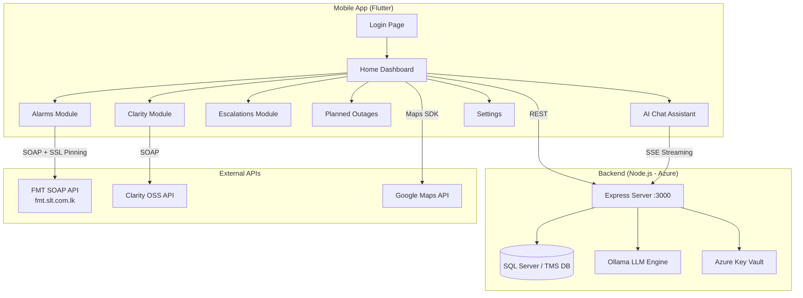

# 📊 SLTNOC — Professional Project Analysis Report
**Analyzed by:** Antigravity AI · **Date:** September 13, 2026  
**Project Path:** `D:\SLT_Projects\SLTNOC`

---

## 🏢 Executive Summary

**SLTNOC** is a **Network Operations Center (NOC) mobile & web application** built for **SLT (Sri Lanka Telecom)**. It is a production-grade, full-stack monitoring platform that provides real-time network alarm visibility, escalation management, Clarity OSS integration, GPS element tracking, and an AI-powered chatbot assistant — all on a single Flutter application backed by a Node.js REST API.

> [!IMPORTANT]
> This is a **mature, feature-complete internal enterprise app**. It is not a prototype — it is actively deployed with Azure cloud infrastructure, SOAP integrations, and AI capabilities.

---

## 🧱 Technology Stack

| Layer | Technology | Purpose |
|-------|-----------|---------|
| **Frontend** | Flutter (Dart) `>=3.2.4` | Cross-platform mobile app (Android/iOS) |
| **Backend API** | Node.js + Express.js | REST middleware server |
| **AI Engine** | Ollama (LLM local model `llama3`) | AI chatbot with NOC context |
| **Database** | Microsoft SQL Server (TMS DB) | Network fault & escalation data |
| **Cloud** | Azure App Service + Azure Key Vault | API hosting + secrets management |
| **Maps** | Google Maps Flutter | Node location visualization |
| **SOAP Integration** | FMT Backend (`fmt.slt.com.lk`) | Primary NOC data source |
| **OSS** | Clarity (SLT internal) | Engineering work group data |
| **Notifications** | Flutter Local Notifications | Push/local alert system |
| **Storage** | Shared Preferences + Secure Storage | Credentials + session management |
| **Font** | Poppins | Custom branding |

---

## 🗺️ System Architecture Overview



---

## 📁 Project Structure

```
SLTNOC/
├── lib/                         ← Flutter source code
│   ├── main.dart                ← App entry point, routing, overlay
│   ├── app_config.dart          ← Global design constants
│   ├── home_page.dart           ← Home dashboard (~1400 lines)
│   ├── login_page.dart          ← SOAP authentication
│   ├── ai_chat_page.dart        ← AI chatbot (~2400 lines, most complex)
│   ├── escalations_page.dart    ← Escalation hub
│   ├── clarity_page.dart        ← Clarity OSS dashboard
│   ├── settings_page.dart       ← App settings
│   ├── alarms/                  ← Alarms feature module
│   │   ├── current_alarms/      ← 12 files: live alarms, node details
│   │   ├── element_locations/   ← GPS view (hierarchical)
│   │   ├── elements_map/        ← Map view pages
│   │   └── update_element_locations/
│   ├── clarity/                 ← Clarity OSS modules
│   │   ├── CEN-CSC-NW/          ← Network group
│   │   ├── CEN-CSC-DATA/        ← Data group
│   │   ├── CEN-CSC-CC/          ← Contact center
│   │   ├── CEN-CSC-MS/          ← MS group
│   │   ├── CLARITY NW FAULTS/
│   │   ├── Service-Order-Details/
│   │   └── work_groups/
│   ├── escalations/             ← Escalation module
│   │   ├── FAULTS/
│   │   ├── Problems/
│   │   ├── Common Issues/
│   │   ├── Planned Events/
│   │   ├── manual_escalation_service.dart
│   │   ├── manual_escalation_queue.dart
│   │   └── fault_count_service.dart
│   ├── planOutages/             ← Planned outages
│   ├── service/                 ← Core services (Notifications)
│   └── widgets/                 ← Reusable UI components
│
├── routes/                      ← Node.js API routes
│   ├── db.js                    ← SQL Server query layer (~17KB)
│   ├── aiTools.js               ← AI context fetchers
│   ├── alarms1.js / alarms2.js  ← Alarm endpoints
│   ├── alarmsDetails1.js        ← Alarm detail endpoint
│   ├── nodeDetails.js           ← Node lookup endpoint
│   ├── manualEscalations.js     ← CRUD for manual escalations
│   ├── provinces.js             ← Province/region data
│   └── dbConfig.js              ← DB connection config
│
├── server.js                    ← Main Express server + AI chat endpoints
├── data/                        ← Persistent data (manual_escalations.json)
├── docs/                        ← Internal documentation (7 md files)
├── assets/                      ← Images, certs, logos
├── pubspec.yaml                 ← Flutter dependencies
└── package.json                 ← Node.js dependencies
```

---

## 🚀 Feature Inventory

| # | Feature | Status | Complexity | Module |
|---|---------|--------|-----------|--------|
| 1 | **User Authentication (SOAP)** | ✅ Complete | Medium | `login_page.dart` |
| 2 | **Auto-login / Session Management** | ✅ Complete | Low | `main.dart` |
| 3 | **Real-time Alarm Map (Google Maps)** | ✅ Complete | High | `home_page.dart` |
| 4 | **Node Down Fault Listing** | ✅ Complete | High | `current_alarms/` |
| 5 | **Node Details Drill-down** | ✅ Complete | High | `node_details.dart` |
| 6 | **Alarm Type Breakdown** | ✅ Complete | Medium | `alarm_type_details.dart` |
| 7 | **Metro / Region Filtering** | ✅ Complete | Medium | `regions.dart` |
| 8 | **Clarity OSS Integration (5 groups)** | ✅ Complete | Medium | `clarity/` |
| 9 | **Work Groups Drill-down** | ✅ Complete | Medium | `work_groups/` |
| 10 | **Service Order (CCT) Details** | ✅ Complete | Medium | `Service-Order-Details/` |
| 11 | **Manual Escalation CRUD** | ✅ Complete | High | `escalations/` |
| 12 | **Escalation Queue (Offline-first)** | ✅ Complete | High | `manual_escalation_queue.dart` |
| 13 | **Background Fault Count Polling** | ✅ Complete | Medium | `fault_count_service.dart` |
| 14 | **Local Push Notifications** | ✅ Complete | Medium | `notification_service.dart` |
| 15 | **App Badge Counter** | ✅ Complete | Low | `flutter_app_badger` |
| 16 | **Planned Outages Viewer** | ✅ Complete | Low | `planOutages/` |
| 17 | **Element GPS View (Hierarchical Map)** | ✅ Complete | Medium | `element_locations/` |
| 18 | **Element GPS Update (SOAP)** | ✅ Complete | Medium | `update_element_locations/` |
| 19 | **AI Chat Assistant (NOC-aware)** | ✅ Complete | Very High | `ai_chat_page.dart` |
| 20 | **AI Streaming (SSE)** | ✅ Complete | High | `server.js` |
| 21 | **Speech-to-Text Input** | ✅ Complete | High | `ai_chat_page.dart` |
| 22 | **Text-to-Speech Output** | ✅ Complete | High | `ai_chat_page.dart` |
| 23 | **Sinhala Language AI Support** | ✅ Complete | High | `server.js` |
| 24 | **Proactive Critical Alert Banner** | ✅ Complete | Medium | `ai_chat_page.dart` |
| 25 | **Chat Session Management** | ✅ Complete | Medium | `ai_chat_page.dart` |
| 26 | **NOC Tool Presets (Quick Actions)** | ✅ Complete | Low | `ai_chat_page.dart` |
| 27 | **Markdown Rendering (Custom)** | ✅ Complete | High | `ai_chat_page.dart` |
| 28 | **SSL Certificate Pinning** | ✅ Complete | Medium | `http.dart` |
| 29 | **Draggable Global Chat Button** | ✅ Complete | Medium | `draggable_chat_button.dart` |
| 30 | **Settings (Server URL + Logout)** | ✅ Complete | Low | `settings_page.dart` |
| 31 | **Azure Key Vault Integration** | ✅ Complete | Medium | `server.js` |
| 32 | **Recurring Fault Analytics (AI)** | ✅ Complete | Medium | `aiTools.js` |
| 33 | **Province-wise Alarm Query (AI)** | ✅ Complete | Medium | `server.js` |

---

## ⚠️ Issues & Risks Identified

### 🔴 High Priority (Security / Critical)

| # | Issue | Location | Risk |
|---|-------|----------|------|
| 1 | **Credentials stored in SharedPreferences** (not fully migrated to SecureStorage) | `login_page.dart`, `main.dart` | Security — plaintext password on device |
| 2 | **`_DEV_MODE = true` bypass in login** | `login_page.dart` | Auth bypass in production risk |
| 3 | **`backup.dart` (58KB)** unused large file in lib root | `lib/backup.dart` | Dead code, confusion risk |
| 4 | **CORS fully open** (`app.use(cors())`) | `server.js` | Any origin can call the API |

### 🟡 Medium Priority (Quality / Maintainability)

| # | Issue | Location | Impact |
|---|-------|----------|--------|
| 5 | **`ai_chat_page.dart` is ~2400 lines** (monolith) | `lib/ai_chat_page.dart` | Maintainability, testability |
| 6 | **`home_page.dart` is ~1400 lines** with large commented-out code block | `lib/home_page.dart` | Readability |
| 7 | **No state management library** (Provider / Riverpod / Bloc) | Global | Scalability risk as app grows |
| 8 | **README.md is the default Flutter template** | `README.md` | No actual documentation at root |
| 9 | **Multiple unused asset variants** (CardBGMetros1-5, appbarbg20–31, Logo variants) | `assets/` | Binary bloat in build |
| 10 | **`mockDbData.js` present in routes** | `routes/mockDbData.js` | Mock data potentially included in prod |
| 11 | **No `.env` file management** visible | `routes/dbConfig.js` | Config discipline concern |
| 12 | **`chatbot-icon.png` is 1.2MB** | `assets/chatbot-icon.png` | APK size / performance impact |

### 🟢 Low Priority (Improvements)

| # | Issue | Location | Suggestion |
|---|-------|----------|-----------|
| 13 | **No unit tests** beyond default test file | `test/` | Add service/widget tests |
| 14 | **`pubspec.yaml` description** still default | `pubspec.yaml` | Update with real description |
| 15 | **`app_config.dart` has non-`const` statics** using `.shade` | `app_config.dart` | Minor Dart best practice |
| 16 | **`data/manual_escalations.json`** stored in project root | `data/` | Should be server-side only |

---

## 💪 Strengths & What's Done Well

| Area | What's Good |
|------|------------|
| 🏗️ **Architecture** | Clean layered structure: UI → Services → API → DB |
| 🔒 **SSL Pinning** | Custom `SecurityContext` cert pinning for FMT SOAP API |
| 📡 **Offline Escalation Queue** | Escalations queued locally and synced on reconnect |
| 🤖 **AI Integration** | SSE streaming + Ollama + NOC context injection — very advanced |
| 🌐 **Multilingual AI** | Sinhala / Singlish language detection & response — impressive |
| 📖 **Internal Documentation** | 7 detailed `.md` files in `/docs` covering architecture, API, features, dataflow |
| 🔔 **Smart Notifications** | Dual channel (silent/loud) notifications with badge counts |
| ⚡ **Performance** | Pre-rendered map markers, SSE streaming, shared polling timers |
| 🔑 **Azure Key Vault** | Production secrets managed via Azure, not hardcoded |
| 🧩 **Modular Feature Folders** | Each feature (alarms, clarity, escalations) has its own folder |

---

## 📋 Recommendations — Action Plan

### Phase 1: Security Hardening (Immediate)
- [ ] **Migrate all credentials** to `flutter_secure_storage` (already imported, partially used)
- [ ] **Disable `_DEV_MODE`** or add a compile-time flag guard
- [ ] **Restrict CORS** in `server.js` to allowed origins (mobile app + internal IPs)
- [ ] **Add API authentication** (JWT or API keys) to Node.js endpoints

### Phase 2: Code Quality (Short-term — 2-4 weeks)
- [ ] **Split `ai_chat_page.dart`** into sub-widgets and service classes
- [ ] **Remove `backup.dart`** or move to a `_archive/` folder
- [ ] **Clean up unused assets** (remove appbarbg20–31 variants, unused logos)
- [ ] **Compress `chatbot-icon.png`** from 1.2MB to <100KB (use WebP)
- [ ] **Update `README.md`** with real project documentation
- [ ] **Remove `_DEV_MODE` code** from production codebase

### Phase 3: Architecture Improvements (Medium-term — 1-2 months)
- [ ] **Introduce state management** (Riverpod recommended) for shared state
- [ ] **Extract reusable widgets** from large page files
- [ ] **Add unit and widget tests** for core services (auth, fault count, escalation)
- [ ] **Environment configuration** — use `.env` + `--dart-define` consistently

### Phase 4: Features & Growth (Longer-term)
- [ ] **Dashboard analytics** — charts for fault trends over time
- [ ] **Role-based access control** (RBAC) based on engineer group
- [ ] **Dark mode** support
- [ ] **Web version** (Flutter Web, `index.html` exists — partially set up)
- [ ] **Export to PDF** for escalation reports

---

## 📊 Project Health Score

| Dimension | Score | Notes |
|-----------|-------|-------|
| **Feature Completeness** | 🟢 95/100 | All major features implemented |
| **Code Organization** | 🟡 72/100 | Good structure, but large files |
| **Security** | 🟠 60/100 | Credential storage & CORS issues |
| **Documentation** | 🟢 80/100 | Excellent internal docs, poor README |
| **Test Coverage** | 🔴 10/100 | Virtually no tests |
| **Performance** | 🟢 85/100 | Good optimization strategies in place |
| **Maintainability** | 🟡 65/100 | Large monolith files hurt this score |
| **Deployment Readiness** | 🟢 82/100 | Azure deployment configured |

**Overall Project Health: 🟡 `69/100` — Solid & Feature-Rich, Needs Security & Quality Hardening**

---

## 🔑 Key Metrics

| Metric | Value |
|--------|-------|
| **Total Dart files** | ~40+ |
| **Largest file** | `ai_chat_page.dart` ~97KB (~2400 lines) |
| **Total Flutter dependencies** | 15 packages |
| **Total Node.js dependencies** | 5 packages |
| **API endpoints (Node.js)** | 10+ REST routes |
| **SOAP operations used** | 8+ (login2, GetDisplayname, faults3, getSelection2, fullenglist, etc.) |
| **Documentation files** | 7 markdown files |
| **Asset files** | 33+ images + 1 SSL cert |
| **Supported platforms** | Android, iOS, Web (partial), Windows, Linux, macOS |
| **AI model** | Ollama `llama3` (configurable via `OLLAMA_MODEL` env) |
| **Deployment** | Azure App Service (`sltnoc-api.azurewebsites.net`) |

---

*Report generated by Antigravity AI — Professional Project Analysis*
