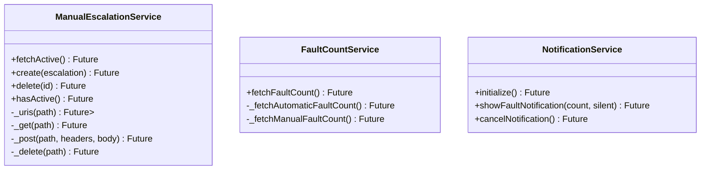
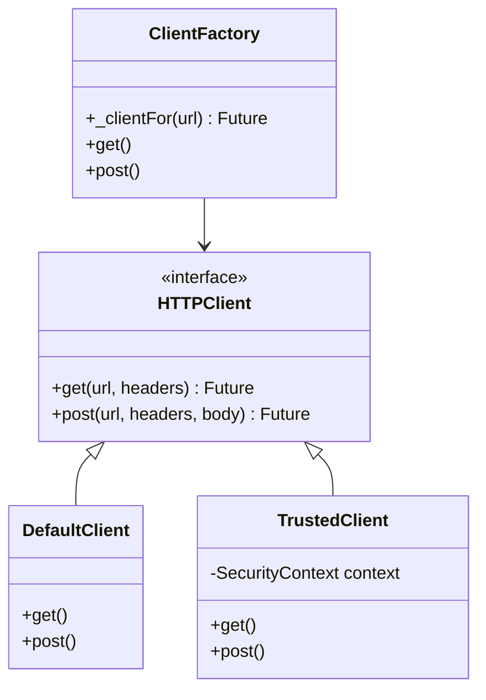
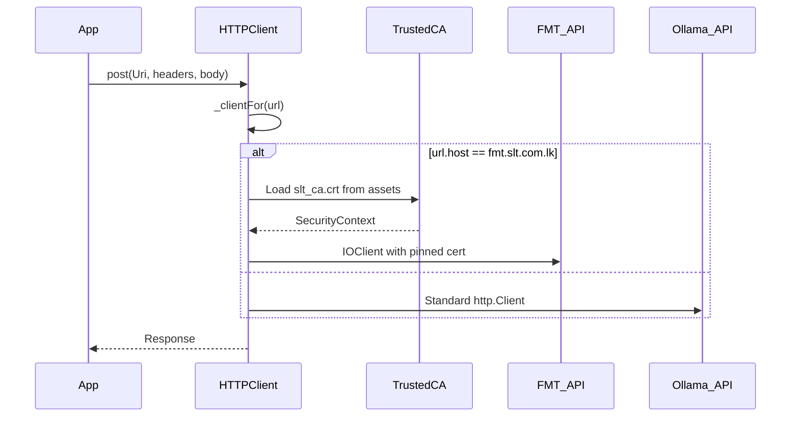
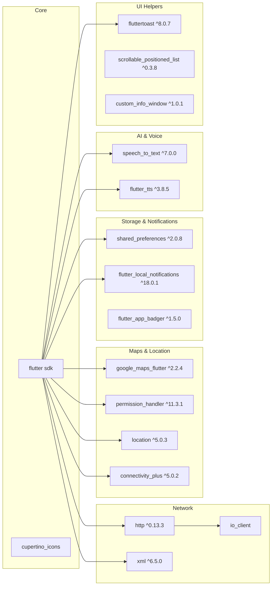

# Architecture Overview

## System Architecture

```mermaid
graph TB
    subgraph "Presentation Layer"
        A[LoginPage] --> B[MyHomePage]
        B --> C[AlarmsPage]
        B --> D[ClarityPage]
        B --> E[EscalationsPage]
        B --> F[PlanOutagesPage]
        B --> G[AIChatPage]
        B --> H[SettingsPage]
    end

    subgraph "Feature Modules"
        C --> C1[Current Alarms]
        C --> C2[Element Locations]
        C --> C3[Update Element Location]
        C --> C4[Elements Map]
        
        D --> D1[Clarity NW Faults]
        D --> D2[CEN-CSC Variants]
        D --> D3[Work Groups]
        D --> D4[Service Order Details]
        
        E --> E1[Faults]
        E --> E2[Planned Events]
        E --> E3[Problems]
        E --> E4[Common Issues]
        E --> E5[Manual Escalation Form]
        
        G --> G1[Chat Sessions]
        G --> G2[Streaming Responses]
        G --> G3[Speech I/O]
        G --> G4[NOC Tools]
    end

    subgraph "Core Services"
        S1[NotificationService]
        S2[FaultCountService]
        S3[ManualEscalationService]
        S4[HTTP Client<br/>(Custom + SSL Pinning)]
    end

    subgraph "Data Layer"
        DL1[SharedPreferences<br/>Auth + Sessions]
        DL2[SOAP API<br/>FMT Backend]
        DL3[REST API<br/>Ollama + Escalation]
    end

    S1 --> DL1
    S2 --> DL2
    S2 --> S3
    S3 --> DL3
    S4 --> DL2
    S4 --> DL3
    B --> S1
    B --> S2
    E --> S3
    G --> S4
```

---

## Design Patterns

### 1. **Repository Pattern** (Services)


### 2. **Provider-less State Management**
- **Local State**: `setState` in `StatefulWidget` for UI-bound state
- **Persistence**: `SharedPreferences` for auth tokens, chat sessions, server URL
- **Background**: `Timer.periodic` for polling (fault counts, AI alerts)
- **Cross-widget**: `GlobalKey<NavigatorState>` + `RouteObserver` for overlay (chat button)

### 3. **Factory Pattern** (HTTP Client)


---

## Security Architecture

### SSL Certificate Pinning


### SSL Certificate Pinning Details
- **Asset**: `assets/certs/slt_ca.crt`
- **Host**: `fmt.slt.com.lk`
- **Implementation**: Custom `SecurityContext` with trusted cert bytes
- **Fallback**: Standard client if cert load fails (debug only)

---

## Dependency Graph



---

## Build Configuration

### App Icons & Assets
```yaml
flutter_launcher_icons:
  android: true
  ios: true
  image_path: "assets/NOCPORTAL.jpg"
  adaptive_icon_background: "#ffffff"
  adaptive_icon_foreground: "assets/NEW.png"
  min_sdk_android: 21
```

### Environment Variables
```bash
# Manual Escalation API Base URL (compile-time)
flutter build apk --dart-define=MANUAL_ESCALATION_API_BASE_URL=http://your-server:3000
```

---

## Performance Considerations

| Area | Strategy |
|------|----------|
| **Map Markers** | Pre-rendered `BitmapDescriptor` from `PictureRecorder` (custom icons) |
| **SOAP Parsing** | Streaming XML parse with `xml` package; batch location requests |
| **Chat Streaming** | SSE parsing with `http.Client.send()` + `Stream` subscription |
| **Image Assets** | WebP/PNG optimized; background images use `BoxFit.cover` |
| **List Rendering** | `SingleChildScrollView` + `DataTable` for tabular data |
| **Background Polling** | 1-min (home) / 30-sec (escalations) with `Timer.periodic` |