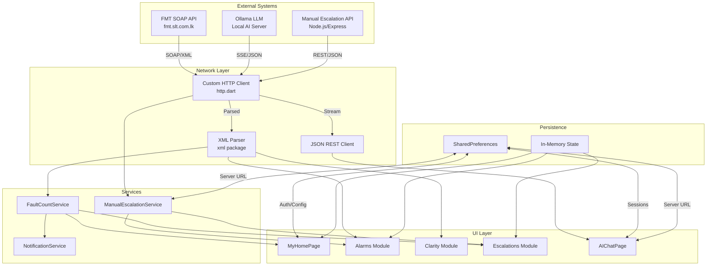
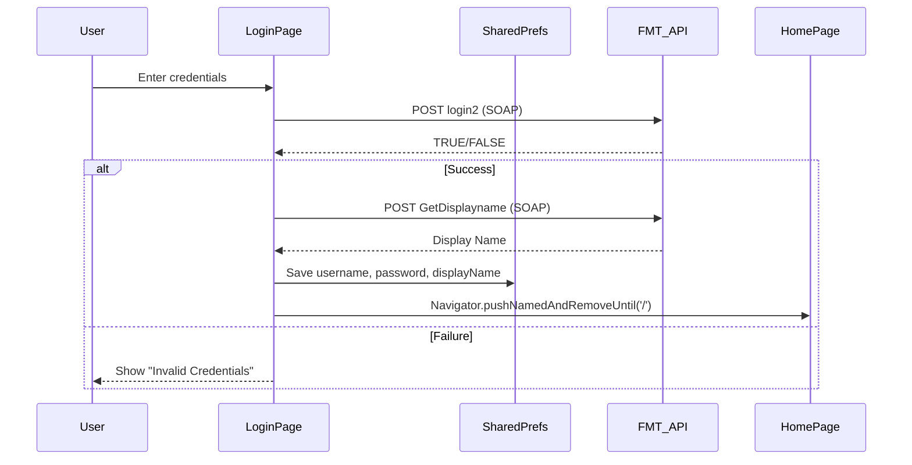
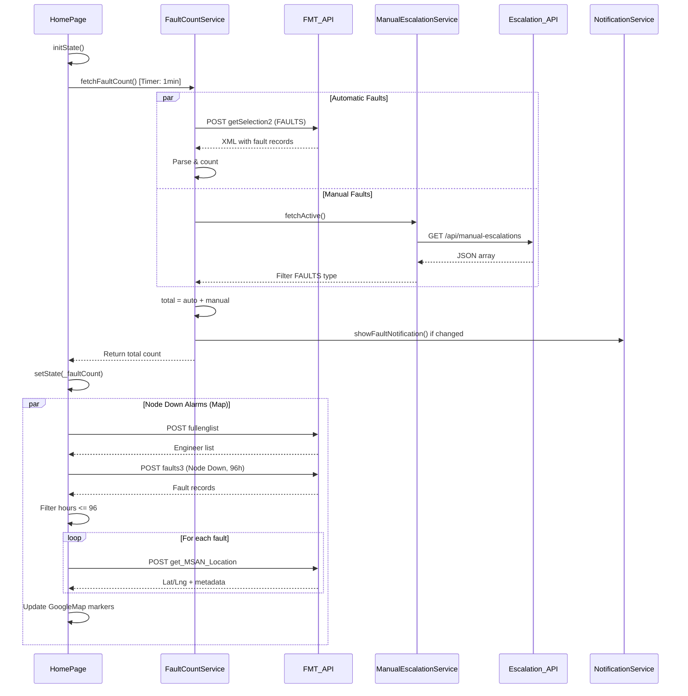
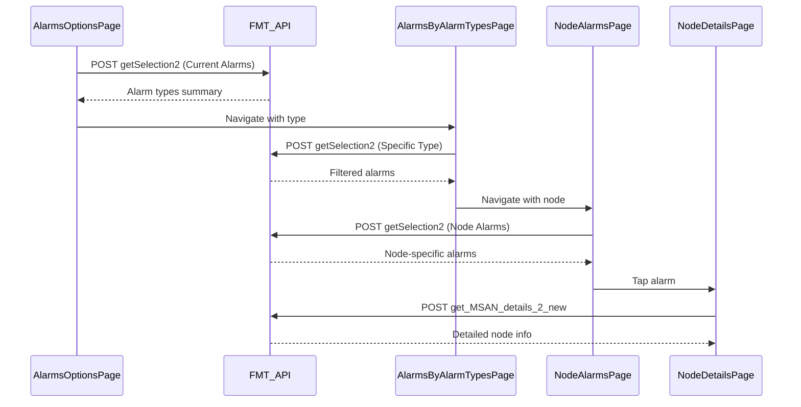
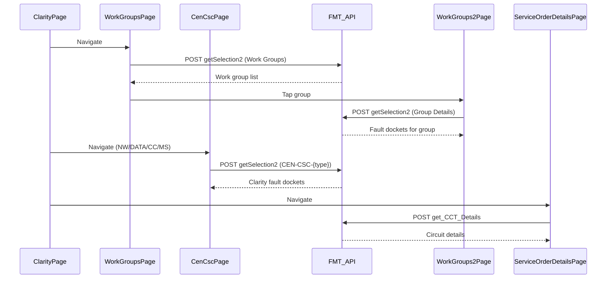
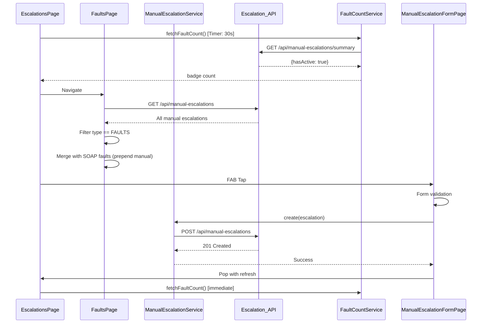
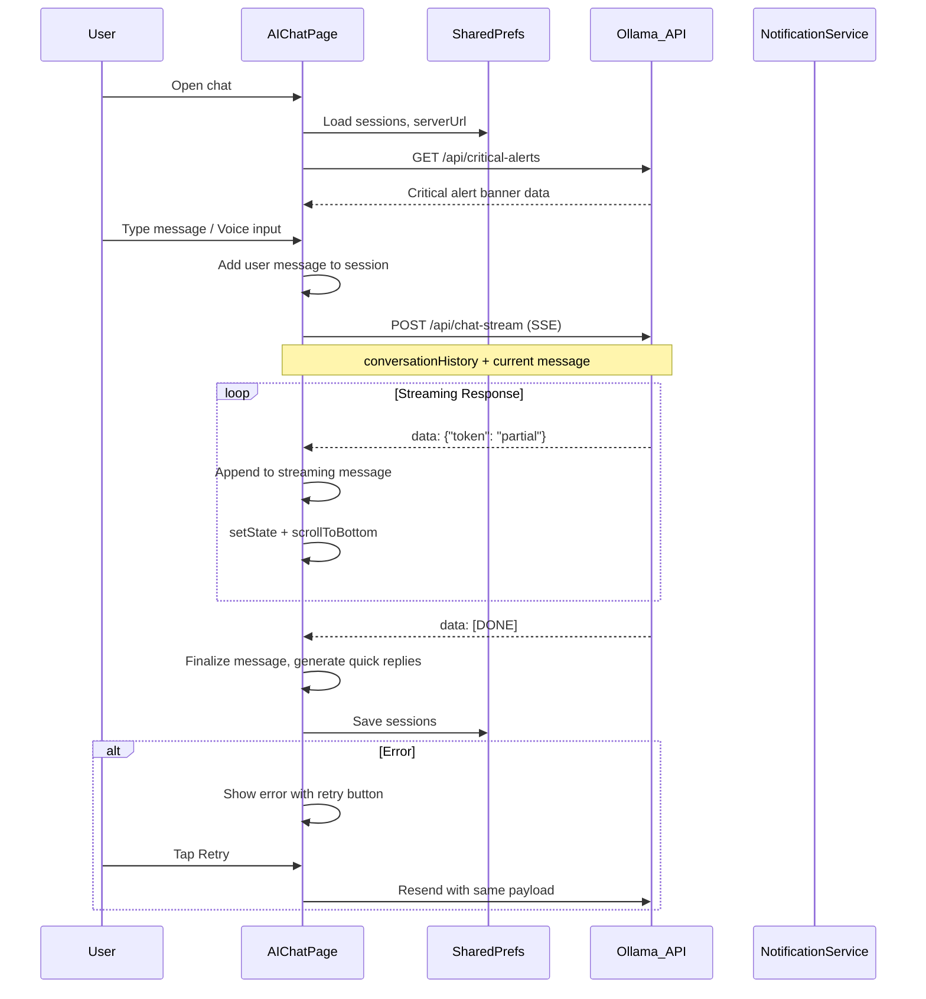
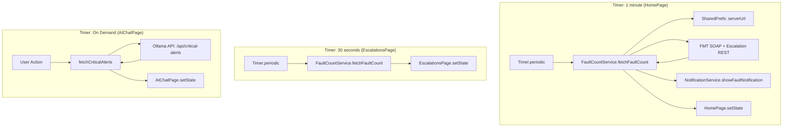
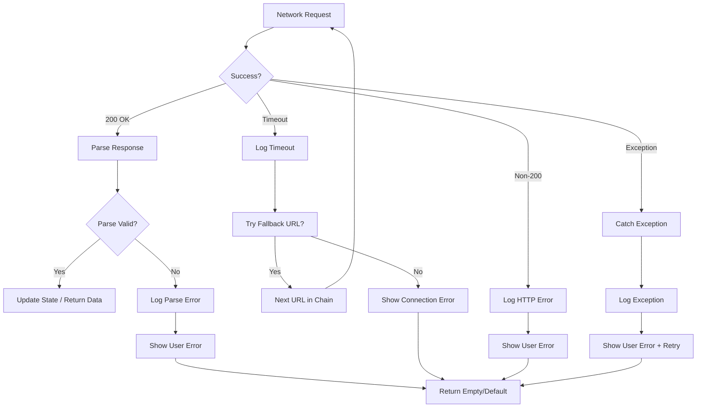

# Data Flow Documentation

## Overview



---

## Authentication Flow



### SOAP Login Request
```xml
<soap:Envelope xmlns:soap="http://schemas.xmlsoap.org/soap/envelope/">
  <soap:Body>
    <login2 xmlns="http://tempuri.org/">
      <username>6-digit-service-number</username>
      <password>user-password</password>
    </login2>
  </soap:Body>
</soap:Envelope>
```

### SOAP GetDisplayname Request
```xml
<soap:Envelope xmlns:soap="http://schemas.xmlsoap.org/soap/envelope/">
  <soap:Body>
    <GetDisplayname xmlns="http://tempuri.org/">
      <svcno>6-digit-service-number</svcno>
      <password>user-password</password>
    </GetDisplayname>
  </soap:Body>
</soap:Envelope>
```

---

## Home Dashboard Data Flow



---

## Alarms Module Data Flow



### Alarm Data Structure (SOAP Response)
```dart
// Parsed from '::' delimited string
{
  "Docket": "ALM-2024-001",
  "Status": "OPEN",
  "Description": "Node Down - MSAN Colombo",
  "Duration": "4 hours",
  // Additional fields from get_MSAN_Location:
  "Latitude": "6.9271",
  "Longitude": "79.8612",
  "Platform": "MSAN",
  "Region": "Western",
  "Site": "Colombo Central",
  "Vendor": "Huawei",
  "Contact1": "Eng. Perera",
  "Contact2": "Eng. Silva",
  // From get_MSAN_details_2_new:
  "Engineer": "A.Gunalathas",
  "AGG": "AGG-COL-01",
  "ODF": "ODF-12",
  "CSCID": "CSC-WEST-001"
}
```

---

## Clarity Module Data Flow



---

## Escalations Module Data Flow



### Manual Escalation Data Model
```dart
class ManualEscalation {
  final String id;                    // MongoDB ObjectId
  final String escalationType;        // FAULTS | PLANNED EVENTS | PROBLEMS | COMMON ISSUES
  final String node;                  // Node identifier
  final String platform;              // MSAN | CEA | GPON | RPB | OTHER
  final String severity;              // CRITICAL | MAJOR | MINOR | POWER | SECURITY
  final String tag;                   // Optional tag
  final String description;           // Detailed description
  final DateTime startAt;             // ISO 8601
  final String reportingBy;           // Reporter name
  final String responsibleOfficer;    // Assigned engineer
  final String status;                // OPEN | IN_PROGRESS | RESOLVED | CLOSED
  
  int get durationHours => DateTime.now().difference(startAt).inHours;
}
```

---

## AI Chat Data Flow



### Chat Streaming Protocol (SSE)
```http
POST /api/chat-stream
Content-Type: application/json

{
  "message": "Show active alarms in Western province",
  "conversationHistory": [
    {"role": "user", "content": "What alarms are active?"},
    {"role": "assistant", "content": "There are 23 active alarms..."}
  ]
}

Response (Server-Sent Events):
data: {"token": "There"}
data: {"token": " are"}
data: {"token": " 23"}
data: {"token": " active"}
data: {"token": " alarms"}
data: {"token": " in"}
data: {"token": " Western"}
data: {"token": " province"}
data: [DONE]
```

---

## Background Services Data Flow



---

## Offline / Fallback Behavior

| Service | Offline Strategy |
|---------|------------------|
| **FMT SOAP** | Request timeout (15s); shows error in UI; map shows last cached markers |
| **Escalation API** | Falls through `_fallbackApiBaseUrls` (8 URLs); tries each with 5s timeout |
| **Ollama AI** | Falls through `_kChatFallbackUrls` (8 URLs); tries each with 5s timeout for both `/api/chat-stream` and `/api/critical-alerts` |
| **Notifications** | Local only; no server dependency |
| **Auth** | Cached credentials in SharedPreferences allow offline login |

### Fallback URL Chain (Manual Escalation)
```dart
const _fallbackApiBaseUrls = [
  'http://192.168.1.8:3000',      // Primary (saved in prefs)
  'http://172.20.10.6:3000',      // Hotspot fallback
  'http://192.168.1.7:3000',      // Alt WiFi
  'http://10.16.188.228:3000',    // Corporate
  'http://192.168.1.10:3000',     // Alt local
  manualEscalationApiBaseUrl,      // Compile-time --dart-define
  'http://10.0.2.2:3000',         // Android emulator
  'http://127.0.0.1:3000',        // iOS simulator / localhost
];
```

### Fallback URL Chain (AI Chat)
```dart
// In lib/ai_chat_page.dart
const _kChatFallbackUrls = [
  'http://192.168.1.8:3000',      // Primary (from SharedPreferences)
  'http://172.20.10.6:3000',      // Mobile hotspot
  'http://192.168.1.7:3000',      // Alternate WiFi
  'http://10.16.188.228:3000',    // Corporate network
  'http://192.168.1.10:3000',     // Backup local
  'http://10.0.2.2:3000',         // Android emulator
  'http://127.0.0.1:3000',        // iOS Simulator / localhost
];
const _kConnectionAttemptTimeout = Duration(seconds: 5);
```

---

## Data Persistence Schema

### SharedPreferences Keys
| Key | Type | Description |
|-----|------|-------------|
| `username` | String | 6-digit SLT service number |
| `password` | String | User password (plaintext - TODO: encrypt) |
| `displayName` | String | Full name from GetDisplayname |
| `serverUrl` | String | Ollama/Escalation API base URL |
| `chat_sessions` | String (JSON) | Array of ChatSession objects |
| `active_session_id` | String | Currently active chat session ID |

### ChatSession JSON Structure
```json
{
  "id": "1704067200000",
  "name": "Chat 1",
  "messages": [
    {
      "id": "1704067201000",
      "text": "Show active alarms",
      "isUser": true,
      "timestamp": "2024-01-01T10:00:01.000Z",
      "status": "sent"
    },
    {
      "id": "1704067202000",
      "text": "There are 23 active alarms...",
      "isUser": false,
      "timestamp": "2024-01-01T10:00:02.000Z",
      "status": "sent"
    }
  ],
  "lastUpdated": "2024-01-01T10:00:02.000Z"
}
```

---

## Error Handling Flow

