# Key Features

## Feature Matrix

| Feature | Module | Status | Complexity |
|---------|--------|--------|------------|
| **User Authentication** | Auth | ✅ Complete | Medium |
| **Real-time Alarm Map** | Alarms/Home | ✅ Complete | High |
| **Clarity OSS Integration** | Clarity | ✅ Complete | Medium |
| **Escalation Management** | Escalations | ✅ Complete | High |
| **Manual Escalation CRUD** | Escalations | ✅ Complete | High |
| **Background Fault Polling** | Core/Services | ✅ Complete | Medium |
| **Push Notifications** | Core/Services | ✅ Complete | Medium |
| **AI Chat Assistant** | AI Chat | ✅ Complete | Very High |
| **Speech I/O (STT/TTS)** | AI Chat | ✅ Complete | High |
| **Markdown Rendering** | AI Chat | ✅ Complete | High |
| **Session Management** | AI Chat | ✅ Complete | Medium |
| **Proactive Alerts** | AI Chat | ✅ Complete | Medium |
| **Element GPS Management** | Alarms | ✅ Complete | Medium |
| **Planned Outages** | PlanOutages | ✅ Complete | Low |

---

## 1. User Authentication

### Login Flow
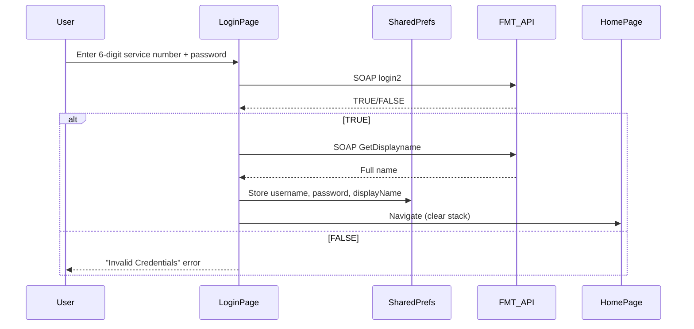

### Features
- **SOAP-based authentication** against FMT backend
- **Credential caching** in `SharedPreferences` for auto-login
- **Display name extraction** via secondary SOAP call
- **Dev Mode** bypass for testing (configurable `_DEV_MODE = true`)
- **Password visibility toggle**
- **Auto-login check** on app start (main.dart route guard)

### Security Notes
⚠️ **Current**: Passwords stored in plaintext in SharedPreferences  
🔒 **Recommended**: Encrypt with `flutter_secure_storage` or platform keystore

---

## 2. Real-time Alarm Map (Home Dashboard)

### Visual Overview
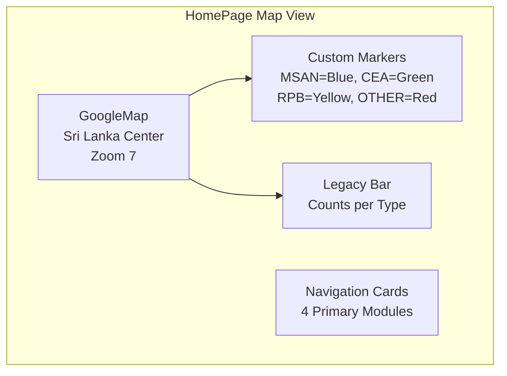

### Data Pipeline
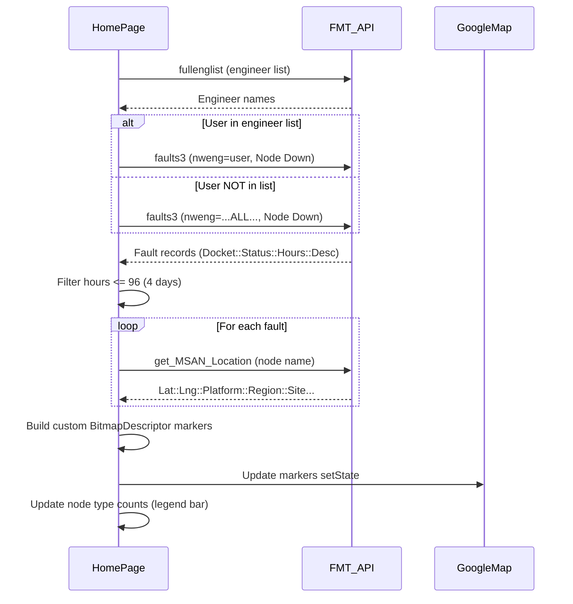

### Map Features
| Feature | Implementation |
|---------|----------------|
| **Custom Markers** | `PictureRecorder` → `Canvas` → `BitmapDescriptor.fromBytes()` |
| **Type Colors** | MSAN=Blue, CEA=Green, RPB=Yellow, OTHER=Red |
| **Marker Labels** | Single letter (M, C, R) on colored circles |
| **Info Window** | Title=Node, Snippet=Duration\|Description |
| **My Location** | Enabled with location button |
| **Traffic Layer** | Enabled |
| **Loading Overlay** | Semi-transparent with progress text |
| **Auto-refresh** | 1-minute timer via `FaultCountService` |

### Node Type Legend Bar
```dart
// Dynamic counts displayed under map
Row(
  children: [
    _buildLegacyBarItem('MSAN', Colors.blue),   // count badge
    _buildLegacyBarItem('CEA', Colors.green),
    _buildLegacyBarItem('RPB', Colors.yellow),
    _buildLegacyBarItem('OTHER', Colors.red),
  ],
)
```

---

## 3. Clarity OSS Integration

### Work Groups Hierarchy
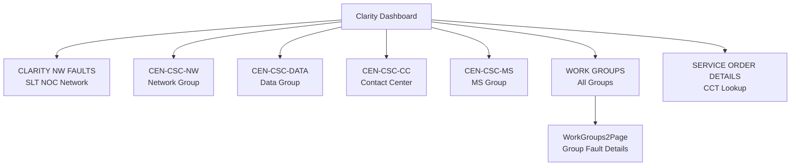

### Data Source
All Clarity data via **SOAP `getSelection2`** with different `selection` parameters:
- `CLARITY NW FAULTS` → SLT NOC network faults
- `CEN-CSC-NW/DATA/CC/MS` → Respective engineering group dockets
- `Work Groups` → List of all work groups
- `get_CCT_Details` → Circuit (CCT) information

### Table Features
- **DataTable** with custom styling (header color, row colors)
- **Responsive columns** (Fault, Hours, Action)
- **Loading indicator** during SOAP fetch
- **Error handling** with retry

---

## 4. Escalation Management

### Dashboard (EscalationsPage)
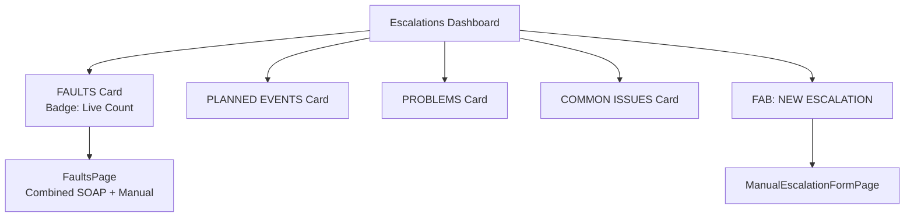

### Fault Count Service (Background Polling)
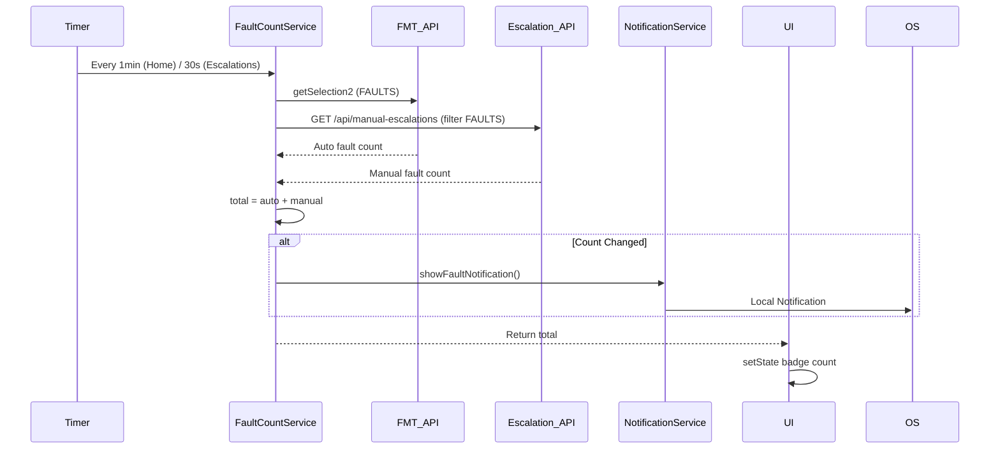

### Manual Escalation Form
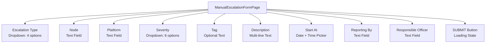

**Validation Rules:**
- All fields required except Tag
- Severity: CRITICAL, MAJOR, MINOR, POWER, SECURITY
- Type: FAULTS, PLANNED EVENTS, PROBLEMS, COMMON ISSUES
- Status auto-set to `OPEN`

### Offline-First Sync
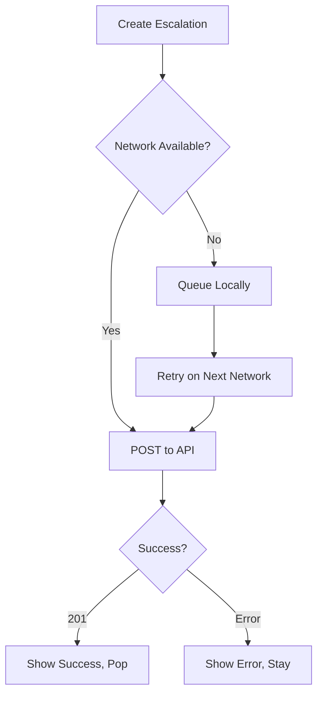

---

## 5. AI Chat Assistant (AIChatPage)

> **Most complex module** — ~2400 lines single file

### Architecture
```mermaid
graph TB
    AIChatPage[AIChatPage<br/>StatefulWidget + TickerProvider]
    
    subgraph "Core State"
        Sessions[List<ChatSession>]
        ActiveSession[ChatSession]
        Messages[List<ChatMessage>]
        Streaming[ChatMessage?]
        QuickReplies[List<String>]
    end
    
    subgraph "Speech"
        STT[SpeechToText]
        TTS[FlutterTts]
        Sinhala[Auto Sinhala Detection]
    end
    
    subgraph "Network"
        SSE[SSE Streaming Client]
        ServerURL[Configurable Server URL]
        CriticalAlerts[Proactive Alert API]
    end
    
    subgraph "UI"
        Header[Animated Header]
        AlertBanner[Critical Alert Banner]
        MessagesArea[ListView + Welcome]
        QuickChips[Horizontal Quick Replies]
        InputRow[TextField + Mic + Send]
        SessionsDrawer[Slide-in Sessions]
        ToolsSheet[NOC Preset Tools]
        ActionsSheet[Message Actions]
        SettingsDialog[Server Config]
    end
    
    AIChatPage --> Sessions
    AIChatPage --> STT
    AIChatPage --> TTS
    AIChatPage --> SSE
    AIChatPage --> Header
    AIChatPage --> AlertBanner
    AIChatPage --> MessagesArea
    AIChatPage --> QuickChips
    AIChatPage --> InputRow
    AIChatPage --> SessionsDrawer
    AIChatPage --> ToolsSheet
    AIChatPage --> ActionsSheet
    AIChatPage --> SettingsDialog
```

### Key Features

#### Streaming Responses (SSE)
- Token-by-token rendering with cursor animation
- Automatic scroll-to-bottom
- Conversation history context sent with each request

#### Message Actions (Long Press)
| Action | Description |
|--------|-------------|
| **Copy** | Copy message text to clipboard |
| **Edit & Resend** | (User messages) Truncate history, pre-fill input |
| **Share** | Copy to clipboard with toast |
| **Speak** | (AI messages) TTS with auto Sinhala/English detection |

#### Quick Replies (Context-Aware)
```dart
// Auto-generated from AI response content
if (lower.contains('alarm')) 
  suggestions.addAll(['Show active alarms', 'How many critical alarms?']);
if (lower.contains('node') || lower.contains('network')) 
  suggestions.addAll(['Node status summary', 'Show node locations']);
if (lower.contains('escalat')) 
  suggestions.add('List open escalations');
// ... more patterns
```

#### Action Chips (Smart Detection)
| Pattern | Chip Action |
|---------|-------------|
| Node names (MSAN, OLT, BTS, etc.) | "Node: NAME" → Query details |
| Engineering groups (CEN-CSC-NW) | "Group: NAME" → Query alarms |
| Provinces (Western, Southern, etc.) | "Province Alarms" → Query province |
| "escalation" | "Active Escalations" → Query |
| "recurring/predict" | "Predictive Report" → Query |

#### NOC Tools Preset (Grid Button)
| Tool | Prompt |
|------|--------|
| **Predict Faults** | "Show recurring and high-risk fault nodes" |
| **Escalations** | "Show active manual escalations" |
| **Alarm Matrix** | "Show general alarms summary" |
| **Log Analysis** | Pre-fills: "SYS_LOG: Colombo_MSAN_02 Port Ethernet 0/1 Link Down..." |

#### Session Management
- **Multiple sessions** with rename/delete
- **Persistent** in SharedPreferences (JSON)
- **Drawer navigation** with active indicator
- **Export** chat to clipboard (formatted transcript)

#### Proactive Critical Alerts
- Polls `/api/critical-alerts` on init
- Shows banner if `hasCriticalAlert: true`
- One-tap "Inspect" sends query to AI

#### Markdown Rendering (Custom)
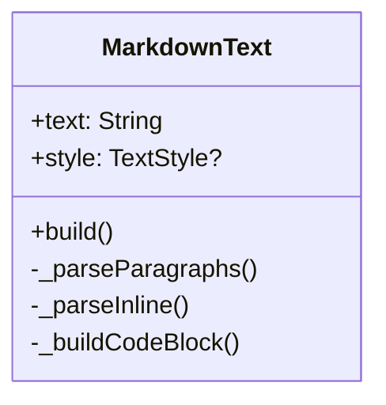

**Supported Syntax:**
- Headings: `# ## ###`
- Bold: `**text**`
- Italic: `_text_`
- Inline code: `` `code` ``
- Code blocks: ```lang\ncode\n```
- Lists: `- item` or `1. item`
- Paragraphs: Auto-wrapped

#### Speech Features
- **STT**: Continuous listening (30s timeout, 3s pause)
- **TTS**: Auto language detection (Sinhala Unicode range `඀-෿`)
- **Per-message speak/stop** with volume icon toggle

---

## 6. Element GPS Management

### View Locations (ElementsLocationPage)
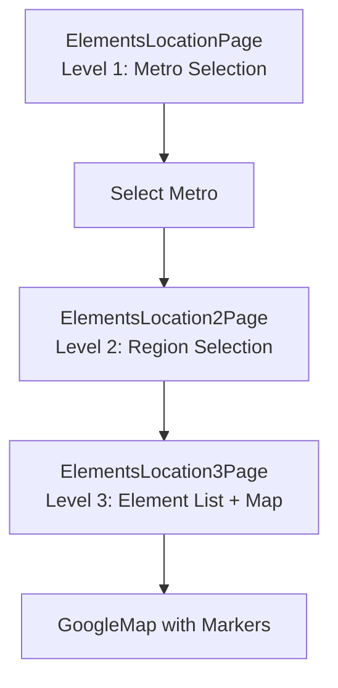

### Update Locations (UpdateElementsLocationPage)
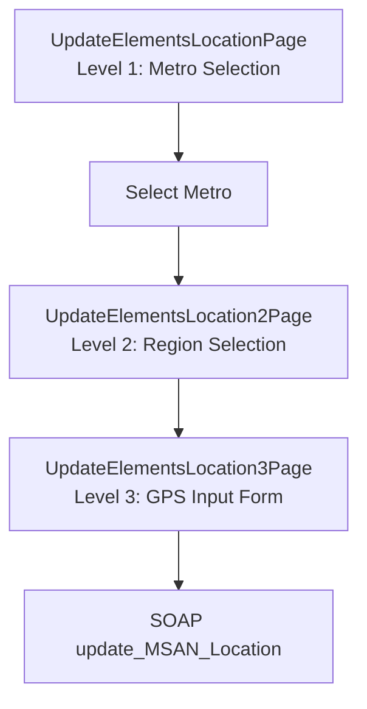

### Features
- **Hierarchical navigation**: Metro → Region → Element
- **Google Maps integration** for visual verification
- **GPS coordinate input** with validation
- **SOAP update** to FMT backend
- **Error dialogs** for failed updates

---

## 7. Planned Outages

### PlanOutagesPage
- **Data Source**: SOAP `getSelection2` with `PLANNED EVENTS`
- **Display**: DataTable with Fault, Hours, Action columns
- **Simple list view** with loading/error states

---

## 8. Settings & Configuration

### SettingsPage
| Setting | Storage | Description |
|---------|---------|-------------|
| **Server URL** | SharedPreferences | Ollama/Escalation API base URL |
| **Logout** | SharedPreferences | Clear credentials, navigate to login |
| **App Info** | — | Version, build info |

### Global Floating Chat Button
- **DraggableChatButton** overlay via `MyApp.builder`
- **RouteAware**: Shows only when logged in
- **Auto-hide** on login page, show on home+

---

## 9. Notifications

### Local Notifications (flutter_local_notifications)
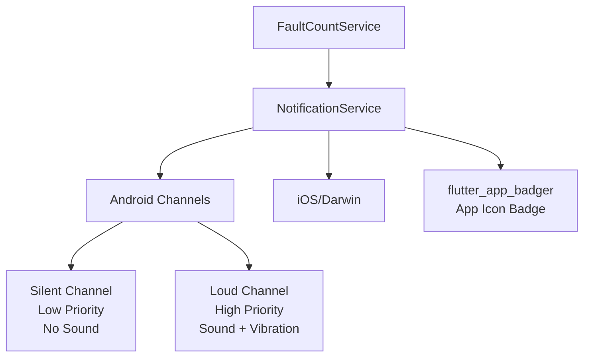

### Notification Logic
| Condition | Channel | Sound | Badge |
|-----------|---------|-------|-------|
| First check, faults > 0 | Loud | ✅ | Count |
| Faults increased | Loud | ✅ | New Count |
| Faults decreased | Silent | ❌ | New Count |
| Faults = 0 | Cancel | — | Clear |

---

## 10. Loading & Error States

### Custom Loading Indicator
```dart
// loading_indicator.dart
CustomLoadingIndicator() // Branded spinner with SLT colors
```

### Error Handling Patterns
| Pattern | Implementation |
|---------|----------------|
| **SOAP Errors** | Try-catch + status code check + user toast |
| **Network Timeout** | 15s timeout (SOAP), 5s per fallback URL (REST) |
| **REST Fallback (Escalation API)** | 8 fallback URLs tried sequentially (`_fallbackApiBaseUrls` in `manual_escalation_service.dart`) |
| **REST Fallback (AI Chat API)** | 8 fallback URLs tried sequentially (`_kChatFallbackUrls` in `ai_chat_page.dart`) for both chat streaming and critical alerts |
| **Parse Errors** | Graceful degradation, log + empty state |
| **Retry** | Manual refresh buttons, pull-to-refresh (where applicable) |
| **Offline** | Cached data where possible (markers, chat history) |

---

## Performance Metrics

| Feature | Optimization |
|---------|--------------|
| **Map Markers** | Pre-rendered BitmapDescriptors (not rebuilt per frame) |
| **Chat Streaming** | Single `setState` per token batch, not per character |
| **SOAP Parsing** | `xml` package streaming parse, not DOM for large responses |
| **Background Polling** | Shared `FaultCountService` instance, not per-widget timers |
| **Image Assets** | WebP/PNG, `BoxFit.cover` for backgrounds |
| **List Rendering** | `SingleChildScrollView` + `DataTable` (not `ListView.builder` for tables) |