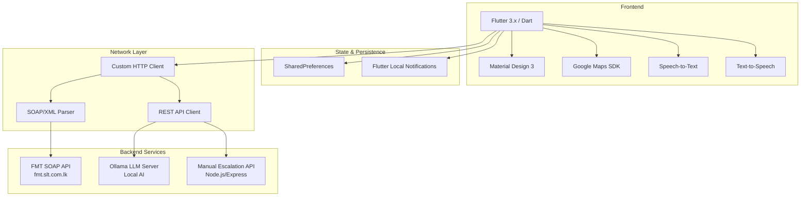

# SLT NOC Portal - Technical Documentation

> **Project**: SLT Network Operations Center (NOC) Mobile Application  
> **Framework**: Flutter 3.x (Dart)  
> **Platform**: Android / iOS  
> **Version**: 1.0.0+1

---

## 📚 Documentation Index

| Document | Description |
|----------|-------------|
| [Architecture Overview](architecture.md) | System architecture, tech stack, and design patterns |
| [Navigation Flow](navigation.md) | App routing, screen hierarchy, and user flows |
| [Data Flow](dataflow.md) | Data sources, API integration, and state management |
| [Module Structure](modules.md) | Feature modules, components, and responsibilities |
| [API Integration](api.md) | SOAP/REST endpoints, authentication, and error handling |
| [Key Features](features.md) | Core functionalities and implementation details |
| [Development Guide](development.md) | Setup, build, testing, and deployment |

---

## 🎯 Project Overview

The **SLT NOC Portal** is a Flutter-based mobile application designed for **Sri Lanka Telecom (SLT) Network Operations Center** engineers to monitor, manage, and escalate network faults in real-time.

### Core Capabilities

- **Real-time Alarm Monitoring** — Google Maps visualization of node-down alarms across Sri Lanka
- **Clarity OSS Integration** — Fault docket tracking for CEN-CSC work groups
- **Escalation Management** — Manual fault escalation creation with offline-first sync
- **AI-Powered Assistant** — Natural language queries for NOC operations (Ollama backend)
- **Push Notifications** — Background fault count monitoring with local notifications

### Technology Stack



---

## 🚀 Quick Start

```bash
# Install dependencies
flutter pub get

# Run on device/emulator
flutter run

# Build release APK
flutter build apk --release

# Build iOS (requires macOS)
flutter build ios --release
```

---

## 📱 Supported Platforms

| Platform | Min Version | Status |
|----------|-------------|--------|
| Android | API 21 (Android 5.0) | ✅ Supported |
| iOS | iOS 12+ | ✅ Supported |

---

## 📄 License

Internal SLT Project — Confidential