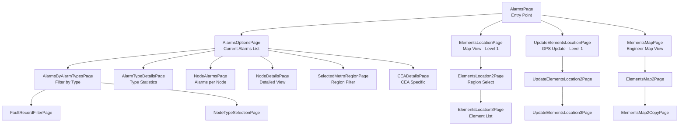
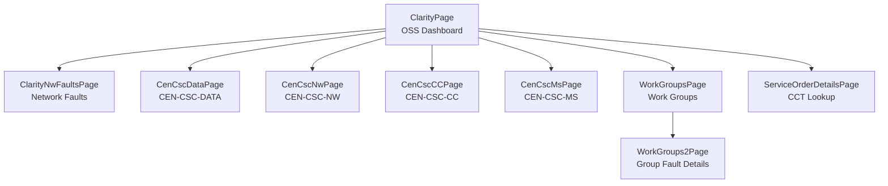
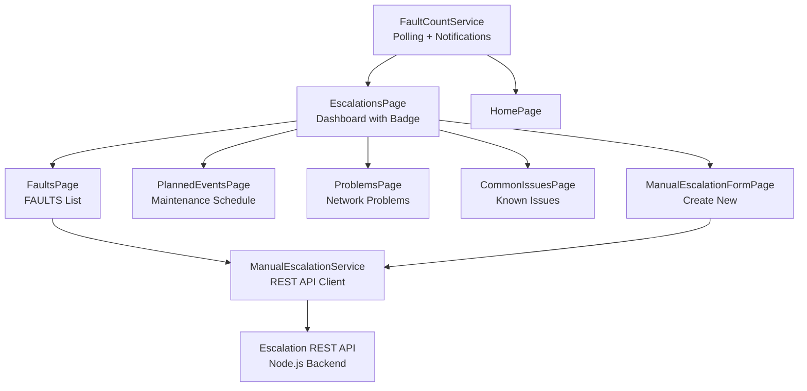
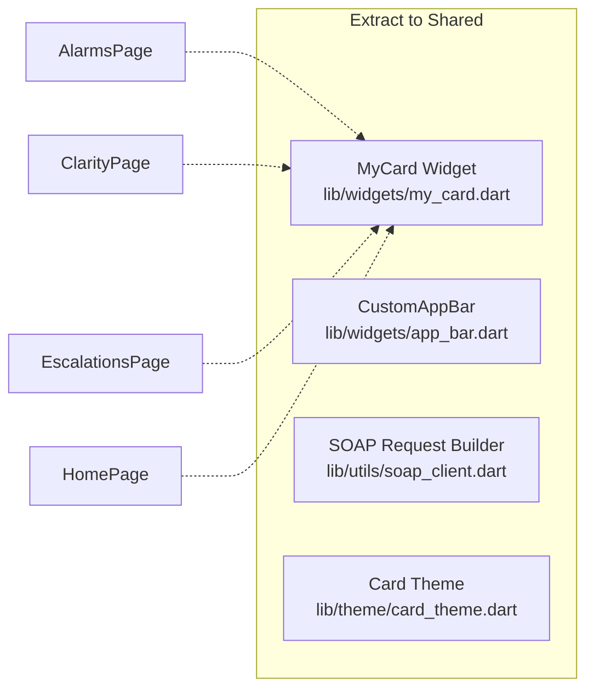
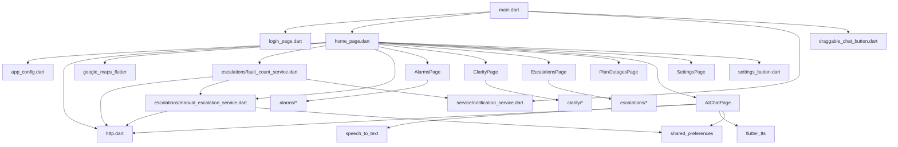

# Module Structure

## Directory Layout

```
lib/
├── main.dart                      # App entry, routing, global overlay
├── app_config.dart                # Design system constants
├── http.dart                      # Custom HTTP client with SSL pinning
├── login_page.dart                # Authentication screen
├── home_page.dart                 # Main dashboard with map
├── alarms_page.dart               # Alarms module entry
├── clarity_page.dart              # Clarity/OSS module entry
├── escalations_page.dart          # Escalations module entry
├── planOutages/
│   └── plan_Outages.dart          # Planned outages
├── settings_page.dart             # Settings & logout
├── ai_chat_page.dart              # AI Assistant (2000+ lines)
├── draggable_chat_button.dart     # Floating chat overlay
├── loading_indicator.dart         # Custom loading widget
├── settings_button.dart           # Reusable settings icon
├── image_page.dart                # Full-screen image viewer
├── backup.dart                    # Legacy/backup code
│
├── alarms/
│   ├── current_alarms/
│   │   ├── alarms_by_alarm_types.dart
│   │   ├── alarms_options.dart
│   │   ├── alarm_type_details.dart
│   │   ├── cea_details.dart
│   │   ├── current_alarms.dart
│   │   ├── current_alarms_expanded1.dart
│   │   ├── fault_record_filter.dart
│   │   ├── node_alarms.dart
│   │   ├── node_details.dart
│   │   ├── node_type_selection.dart
│   │   ├── regions.dart
│   │   └── selected_metro_region.dart
│   ├── elements_map/
│   │   ├── elementsMap1.dart
│   │   ├── elementsMap2.dart
│   │   └── elementsMap2Copy.dart
│   ├── element_locations/
│   │   ├── elements_location1.dart
│   │   ├── elements_location2.dart
│   │   ├── elements_location3.dart
│   │   ├── elements_location3Copy.dart
│   │   └── error_dialog.dart
│   └── update_element_locations/
│       ├── update_elements_location1.dart
│       ├── update_elements_location2.dart
│       ├── update_elements_location3.dart
│       └── error_dialog.dart
│
├── clarity/
│   ├── CEN-CSC-CC/
│   │   └── cen-csc-cc.dart
│   ├── CEN-CSC-DATA/
│   │   └── cen-csc-data.dart
│   ├── CEN-CSC-MS/
│   │   └── cen-csc-ms.dart
│   ├── CEN-CSC-NW/
│   │   └── cen-csc-nw.dart
│   ├── CLARITY NW FAULTS/
│   │   └── clarity-nw-faults.dart
│   ├── Service-Order-Details/
│   │   └── service_order_details.dart
│   └── work_groups/
│       ├── work_groups1.dart
│       └── work_groups2.dart
│
├── escalations/
│   ├── Common Issues/
│   │   └── common_issues.dart
│   ├── FAULTS/
│   │   └── faults.dart
│   ├── Planned Events/
│   │   └── planned_events.dart
│   ├── Problems/
│   │   └── problems.dart
│   ├── fault_count_service.dart
│   └── manual_escalation_service.dart
│
├── planOutages/
│   └── plan_Outages.dart
│
└── service/
    └── notification_service.dart
```

---

## Module Responsibilities

### Core Modules

| Module | File | Responsibility |
|--------|------|----------------|
| **App Entry** | `main.dart` | Bootstrap, routing, auth gate, global chat overlay |
| **Config** | `app_config.dart` | Colors, typography, spacing, asset paths (Design System) |
| **HTTP Client** | `http.dart` | SSL-pinned client for FMT; fallback client for others |
| **Auth** | `login_page.dart` | SOAP login, credential storage, dev-mode bypass |
| **Dashboard** | `home_page.dart` | Google Maps, fault polling, node counts, navigation cards |
| **Settings** | `settings_page.dart` | Server URL, logout, app info |

### Alarms Module (`alarms/`)



### Key Alarms Files

| File | Purpose |
|------|---------|
| `alarms_options.dart` | Main alarms list with SOAP `getSelection2` |
| `alarms_by_alarm_types.dart` | Grouped by alarm type (Node Down, Link Down, etc.) |
| `node_alarms.dart` | Alarms for specific node |
| `node_details.dart` | Detailed view with `get_MSAN_details_2_new` |
| `elements_location1.dart` | Google Map with element markers |
| `update_elements_location1.dart` | GPS coordinate update form |
| `elementsMap1.dart` | Engineer-assigned elements on map |

---

### AI Chat Module Fallback URLs

The AI Chat module now implements the same resilient fallback URL pattern as the Manual Escalation Service. Defined in `lib/ai_chat_page.dart`:

```dart
const _kChatFallbackUrls = [
  'http://192.168.1.8:3000',      // Primary (from SharedPreferences)
  'http://172.20.10.6:3000',      // Mobile hotspot
  'http://192.168.1.7:3000',      // Alternate WiFi
  'http://10.16.188.228:3000',    // Corporate network
  'http://192.168.1.10:3000',     // Backup local
  'http://10.0.2.2:3000',         // Android emulator
  'http://127.0.0.1:3000',        // iOS Simulator / localhost
];
const _kConnectionAttemptTimeout = Duration(seconds: 5);
```

Used for both:
- `POST /api/chat-stream` (streaming chat)
- `GET /api/critical-alerts` (proactive alerts)

Each URL is tried sequentially with a 5-second timeout until one succeeds or all fail.

---

### Clarity Module (`clarity/`)



#### Key Clarity Files

| File | SOAP Action | Purpose |
|------|-------------|---------|
| `clarity-nw-faults.dart` | `getSelection2` | SLT NOC network faults |
| `cen-csc-nw.dart` | `getSelection2` | CEN-CSC Network group dockets |
| `cen-csc-data.dart` | `getSelection2` | CEN-CSC Data group dockets |
| `cen-csc-cc.dart` | `getSelection2` | CEN-CSC Contact Center dockets |
| `cen-csc-ms.dart` | `getSelection2` | CEN-CSC MS group dockets |
| `work_groups1.dart` | `getSelection2` | Work group listing |
| `work_groups2.dart` | `getSelection2` | Group-specific fault details |
| `service_order_details.dart` | `get_CCT_Details` | Circuit (CCT) information lookup |

---

### Escalations Module (`escalations/`)



#### Key Escalations Files

| File | Purpose |
|------|---------|
| `escalations_page.dart` | Dashboard with real-time fault badge, FAB for new escalation |
| `faults.dart` | Combined SOAP + manual faults list with delete |
| `planned_events.dart` | Planned maintenance activities |
| `problems.dart` | Network problem records |
| `common_issues.dart` | Known issues knowledge base |
| `fault_count_service.dart` | Background polling (1min home, 30s escalations) |
| `manual_escalation_service.dart` | Full CRUD for manual escalations with fallback URLs |

---

### AI Chat Module (`ai_chat_page.dart`)

> **Note**: Single large file (~2400 lines) containing all chat functionality

```mermaid
graph TB
    AIChatPage[AIChatPage<br/>StatefulWidget + TickerProvider]
    
    subgraph "State Management"
        Sessions[Chat Sessions<br/>List<ChatSession>]
        ActiveSession[Active Session<br/>ChatSession]
        Messages[Messages<br/>List<ChatMessage>]
        Streaming[Streaming Message<br/>ChatMessage?]
        QuickReplies[Quick Replies<br/>List<String>]
        Editing[Editing Message ID<br/>String?]
    end
    
    subgraph "Speech"
        STT[SpeechToText<br/>speech_to_text]
        TTS[FlutterTts<br/>flutter_tts]
        Listening[isListening<br/>Bool]
        Speaking[currentlySpeakingMsgId<br/>String?]
    end
    
    subgraph "UI Components"
        Header[Animated Header<br/>Glow Effect]
        AlertBanner[Critical Alert Banner<br/>Proactive]
        MessagesArea[Messages ListView<br/>Welcome / Chat]
        QuickReplyChips[Quick Reply Chips<br/>Horizontal Scroll]
        InputArea[Input Row<br/>TextField + Mic + Send]
        SessionsDrawer[Sessions Drawer<br/>Slide-in]
        SettingsDialog[Server Settings Dialog]
        ToolsSheet[NOC Tools Bottom Sheet]
        ActionsSheet[Message Actions Sheet]
    end
    
    subgraph "Network"
        SSE[SSE Client<br/>http.Client.send]
        ServerURL[serverUrl<br/>SharedPreferences]
        CriticalAlerts[Critical Alerts API<br/>GET /api/critical-alerts]
    end
    
    AIChatPage --> Sessions
    AIChatPage --> STT
    AIChatPage --> TTS
    AIChatPage --> SSE
    AIChatPage --> Header
    AIChatPage --> AlertBanner
    AIChatPage --> MessagesArea
    AIChatPage --> QuickReplyChips
    AIChatPage --> InputArea
    AIChatPage --> SessionsDrawer
    AIChatPage --> SettingsDialog
    AIChatPage --> ToolsSheet
    AIChatPage --> ActionsSheet
```



#### AI Chat Components

| Component | Lines | Description |
|-----------|-------|-------------|
| `ChatMessage` / `ChatSession` | 15-84 | Data models with JSON serialization |
| `_loadData` / `_saveSessions` | 202-249 | SharedPreferences persistence |
| `_sendMessage` / Streaming | 400-512 | SSE streaming with token accumulation |
| `_buildMessageBubble` | 1255-1486 | Rich bubbles with markdown, actions, TTS |
| `_buildActionChips` | 1749-1836 | Auto-detect nodes, groups, provinces |
| `_showNocToolsSheet` | 1871-1969 | Preset prompts (Predict, Escalations, Alarms) |
| `MarkdownText` | 2157-2411 | Custom markdown renderer (code, headings, lists) |

---

### Shared Components

| Component | File | Used By |
|-----------|------|---------|
| `MyCard` | In each page | Dashboard cards (alarms, clarity, escalations, home) |
| `SettingsButton` | `settings_button.dart` | All AppBars |
| `CustomLoadingIndicator` | `loading_indicator.dart` | FutureBuilder loading states |
| `DraggableChatButton` | `draggable_chat_button.dart` | Global overlay (MyApp builder) |

---

## Code Quality Notes

### Duplication Patterns
- **MyCard**: Duplicated in `alarms_page.dart`, `clarity_page.dart`, `escalations_page.dart`, `home_page.dart` (4 copies)
- **SOAP Boilerplate**: Repeated XML envelope construction across modules
- **AppBar**: Similar structure across all pages

### Refactoring Opportunities


---

## Module Dependencies

