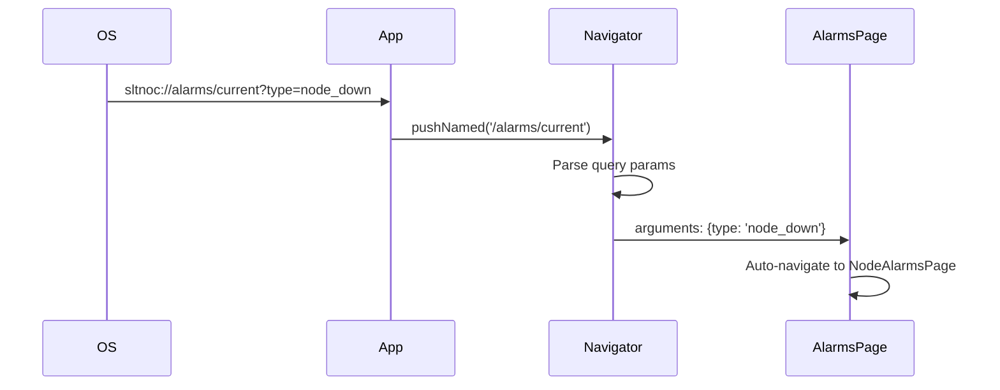
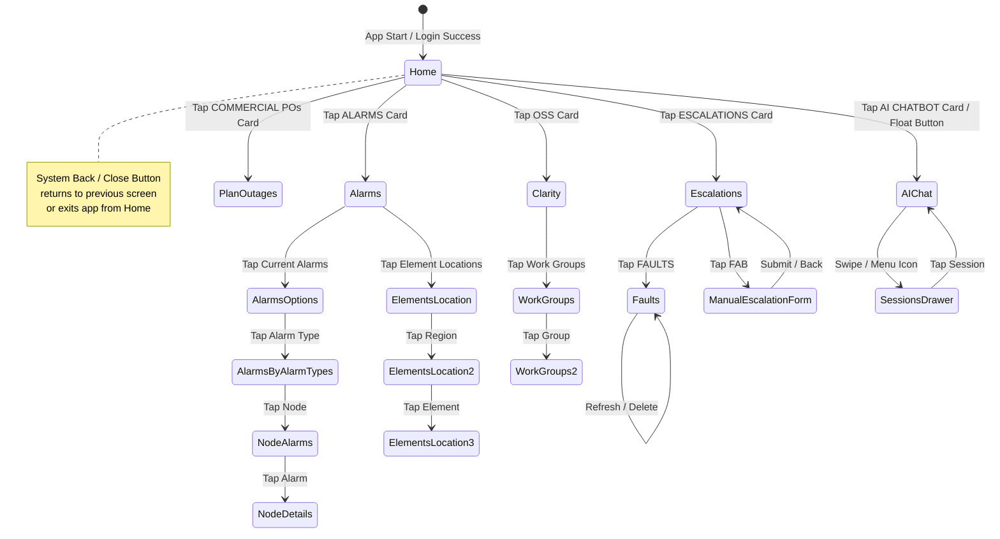
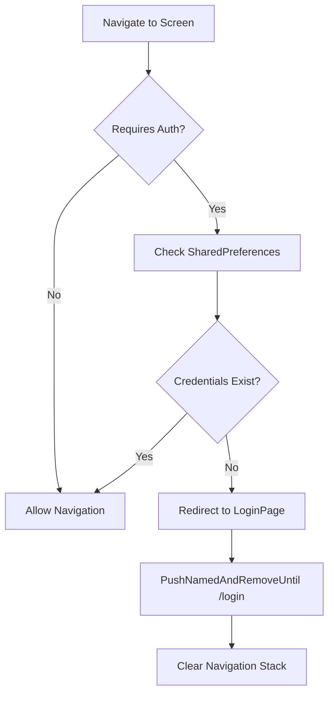

# Navigation Flow

## Route Map

```mermaid
graph TD
    subgraph "Auth Flow"
        START([App Start]) --> CHECK{Session Valid?}
        CHECK -->|No| LOGIN[LoginPage /login]
        CHECK -->|Yes| HOME[MyHomePage /]
        LOGIN -->|Dev Login / Credentials| HOME
        LOGIN -->|Auto-login| HOME
    end

    subgraph "Home Dashboard"
        HOME -->|ALARMS Card| ALARMS[AlarmsPage]
        HOME -->|OSS Card| CLARITY[ClarityPage]
        HOME -->|ESCALATIONS Card| ESCAL[EscalationsPage]
        HOME -->|COMMERCIAL POs Card| PLAN[PlanOutagesPage]
        HOME -->|AI CHATBOT Card| CHAT[AIChatPage]
        HOME -->|Settings Button| SETTINGS[SettingsPage]
        HOME -->|Floating Chat Button| CHAT
    end

    subgraph "Alarms Module"
        ALARMS -->|Current Alarms| CA[AlarmsOptionsPage]
        ALARMS -->|Element Locations| EL[ElementsLocationPage]
        ALARMS -->|Update Element Location| UEL[UpdateElementsLocationPage]
        ALARMS -->|Elements Map| EM[ElementsMapPage]

        CA -->|By Alarm Types| CAT[AlarmsByAlarmTypesPage]
        CA -->|Alarm Options| CAO[AlarmTypeDetailsPage]
        CA -->|Node Alarms| CNA[NodeAlarmsPage]
        CA -->|Node Details| CND[NodeDetailsPage]
        CA -->|Metro/Region Filter| CMR[SelectedMetroRegionPage]
        CA -->|CEA Details| CCE[CEADetailsPage]
    end

    subgraph "Clarity Module"
        CLARITY -->|NW Faults| CNF[ClarityNwFaultsPage]
        CLARITY -->|CEN-CSC-DATA| CCD[CenCscDataPage]
        CLARITY -->|CEN-CSC-NW| CCN[CenCscNwPage]
        CLARITY -->|CEN-CSC-CC| CCC[CenCscCCPage]
        CLARITY -->|CEN-CSC-MS| CCM[CenCscMsPage]
        CLARITY -->|Work Groups| CWG[WorkGroupsPage]
        CLARITY -->|Service Order| CSO[ServiceOrderDetailsPage]

        CWG -->|Work Groups 2| CWG2[WorkGroups2Page]
    end

    subgraph "Escalations Module"
        ESCAL -->|FAULTS| EF[FaultsPage]
        ESCAL -->|PLANNED EVENTS| EP[PlannedEventsPage]
        ESCAL -->|PROBLEMS| EPR[ProblemsPage]
        ESCAL -->|COMMON ISSUES| ECI[CommonIssuesPage]
        ESCAL -->|FAB: NEW ESCALATION| MEF[ManualEscalationFormPage]

        EF -->|Delete| EF
    end

    subgraph "AI Chat Module"
        CHAT -->|Drawer| CHAT_S[Sessions Drawer]
        CHAT -->|Settings| CHAT_SET[Server Settings Dialog]
        CHAT -->|NOC Tools| CHAT_TOOL[NOC Tools Sheet]
        CHAT -->|Message Actions| CHAT_ACT[Action Bottom Sheet]
        CHAT -->|Quick Reply| CHAT
    end

    SETTINGS -->|Logout| LOGIN
```



---

## Screen Hierarchy

```mermaid
graph TB
    subgraph "Level 0: Entry"
        L0[main.dart<br/>MyApp]
    end

    subgraph "Level 1: Auth Gate"
        L1A[LoginPage]
        L1B[MyHomePage<br/>(Dashboard)]
    end

    subgraph "Level 2: Primary Modules"
        L2A[AlarmsPage]
        L2B[ClarityPage]
        L2C[EscalationsPage]
        L2D[PlanOutagesPage]
        L2E[AIChatPage]
        L2F[SettingsPage]
    end

    subgraph "Level 3: Feature Pages"
        L3A1[AlarmsOptionsPage]
        L3A2[ElementsLocationPage]
        L3A3[UpdateElementsLocationPage]
        L3A4[ElementsMapPage]
        
        L3B1[ClarityNwFaultsPage]
        L3B2[CenCscDataPage]
        L3B3[CenCscNwPage]
        L3B4[CenCscCCPage]
        L3B5[CenCscMsPage]
        L3B6[WorkGroupsPage]
        L3B7[ServiceOrderDetailsPage]
        
        L3C1[FaultsPage]
        L3C2[PlannedEventsPage]
        L3C3[ProblemsPage]
        L3C4[CommonIssuesPage]
        L3C5[ManualEscalationFormPage]
    end

    subgraph "Level 4: Detail Pages"
        L4A1[AlarmsByAlarmTypesPage]
        L4A2[AlarmTypeDetailsPage]
        L4A3[NodeAlarmsPage]
        L4A4[NodeDetailsPage]
        L4A5[SelectedMetroRegionPage]
        L4A6[CEADetailsPage]
        L4B1[WorkGroups2Page]
    end

    L0 --> L1A
    L0 --> L1B
    L1B --> L2A
    L1B --> L2B
    L1B --> L2C
    L1B --> L2D
    L1B --> L2E
    L1B --> L2F
    L2A --> L3A1
    L2A --> L3A2
    L2A --> L3A3
    L2A --> L3A4
    L3A1 --> L4A1
    L3A1 --> L4A2
    L3A1 --> L4A3
    L3A1 --> L4A4
    L3A1 --> L4A5
    L3A1 --> L4A6
    L2B --> L3B1
    L2B --> L3B2
    L2B --> L3B3
    L2B --> L3B4
    L2B --> L3B5
    L2B --> L3B6
    L2B --> L3B7
    L3B6 --> L4B1
    L2C --> L3C1
    L2C --> L3C2
    L2C --> L3C3
    L2C --> L3C4
    L2C --> L3C5
    L3C1 -.-> L3C1
```

---

## Navigation Patterns

### 1. **Named Routes** (Auth Only)
```dart
// main.dart
routes: {
  '/': (context) => FutureBuilder<bool>(...),  // Auto-login check
  '/login': (context) => const LoginPage(),
}
```

### 2. **MaterialPageRoute** (All Feature Navigation)
```dart
// Push with data
Navigator.push(
  context,
  MaterialPageRoute(
    builder: (context) => FaultsPage(title: 'FAULTS'),
  ),
).then((_) => _updateFaultCount());  // Refresh on pop
```

### 3. **Global Overlay** (Draggable Chat Button)
```dart
// MyApp builder wraps entire app
builder: (context, child) => Stack(
  children: [
    child!,
    _ChatButtonOverlay(),  // RouteAware - shows only when logged in
  ],
)
```

### 4. **Drawer Navigation** (AI Chat Sessions)
```dart
// AIChatPage
Scaffold(
  drawer: _buildSessionsDrawer(),  // Slide-in session list
  ...
)
```

### 5. **Bottom Sheets & Dialogs**
| Type | Usage |
|------|-------|
| `showModalBottomSheet` | NOC Tools, Message Actions, Session Rename |
| `showDialog` | Delete Confirmation, Server Settings, Error Alerts |
| `AlertDialog` | Login Errors, Session Management |

---

## Deep Linking Support (Future)



### Proposed Route Structure
| Deep Link | Target Screen | Parameters |
|-----------|---------------|------------|
| `sltnoc://home` | MyHomePage | — |
| `sltnoc://alarms` | AlarmsPage | — |
| `sltnoc://alarms/current` | AlarmsOptionsPage | `type`, `region` |
| `sltnoc://alarms/node/{nodeId}` | NodeDetailsPage | `nodeId` |
| `sltnoc://escalations/faults` | FaultsPage | — |
| `sltnoc://escalations/new` | ManualEscalationFormPage | `prefill` |
| `sltnoc://chat` | AIChatPage | `sessionId` |
| `sltnoc://clarity/{group}` | CenCsc*Page | `group` |

---

## Back Navigation Behavior



---

## State Preservation

| Screen | State Preserved | Mechanism |
|--------|-----------------|-----------|
| MyHomePage | Map markers, node counts, fault timer | `_lastMsansWithGeo`, `_nodeTypeCounts`, `_faultTimer` |
| AIChatPage | Chat sessions, active session, messages | `SharedPreferences` (chat_sessions, active_session_id) |
| EscalationsPage | Fault count badge | `FaultCountService` + `Timer.periodic` |
| LoginPage | Dev mode toggle, credentials (optional) | `SharedPreferences` (username, password, displayName) |
| SettingsPage | Server URL, notification prefs | `SharedPreferences` (serverUrl) |

---

## Navigation Guards



### Implementation (main.dart)
```dart
initialRoute: '/',
routes: {
  '/': (context) => FutureBuilder<bool>(
    future: _checkLoginStatus(),
    builder: (context, snapshot) {
      if (snapshot.connectionState == ConnectionState.waiting) {
        return const Scaffold(body: Center(child: CircularProgressIndicator()));
      }
      return snapshot.data == true
          ? FutureBuilder<String?>(...)  // Home with displayName
          : const LoginPage();            // Redirect to login
    },
  ),
  '/login': (context) => const LoginPage(),
}
```