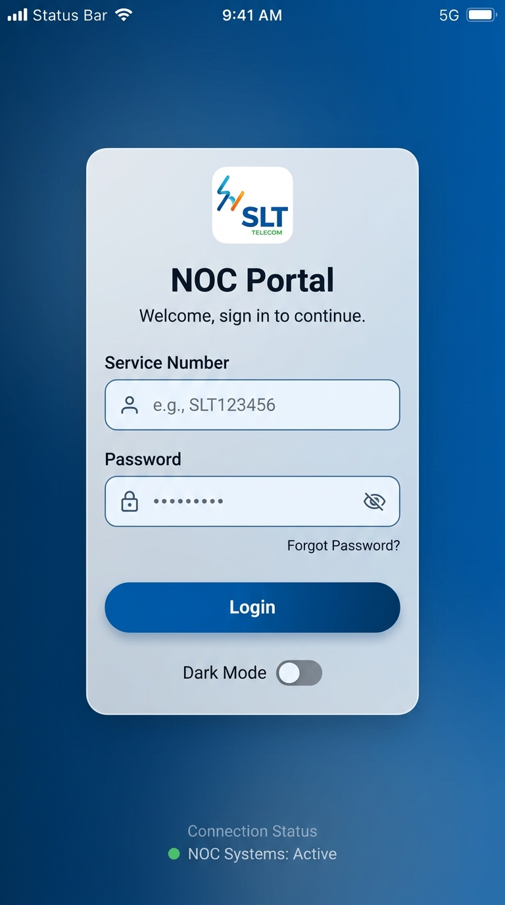
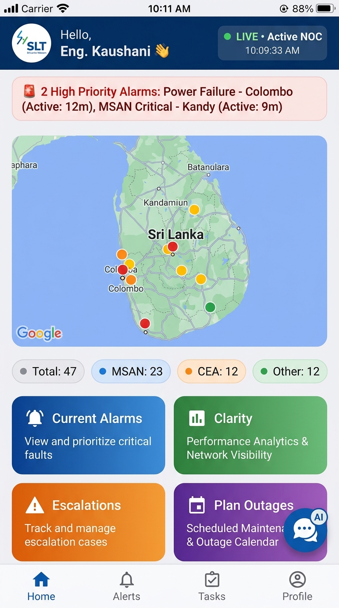
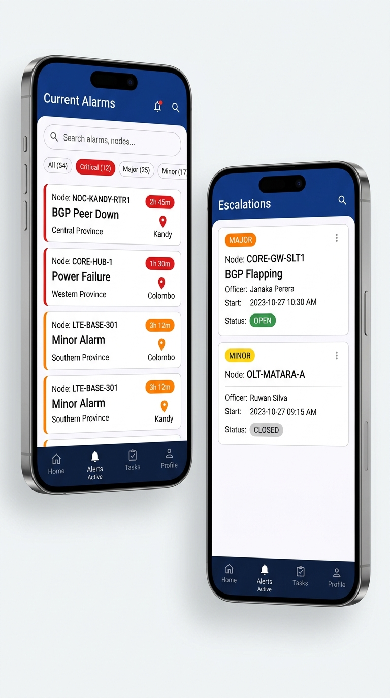
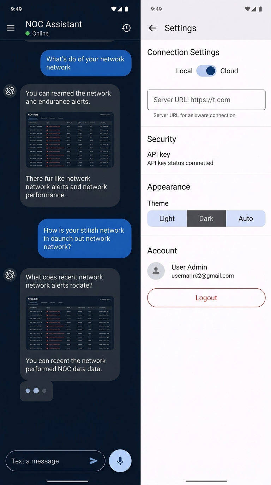

# 🎨 SLTNOC — Professional UI/UX Redesign Plan

> **Document:** Full UI/UX Plan & Design System  
> **Date:** September 2026  
> **Scope:** All screens — Login, Dashboard, Alarms, Escalations, Clarity, AI Chat, Settings  
> **Target:** Flutter Material Design 3 — Android primary, Windows secondary

---

## 📋 Table of Contents
1. [Design Audit — Current State](#1-design-audit--current-state)
2. [Design Principles & Goals](#2-design-principles--goals)
3. [Design System — Tokens](#3-design-system--tokens)
4. [Screen-by-Screen Plan](#4-screen-by-screen-plan)
5. [Navigation Architecture](#5-navigation-architecture)
6. [Component Library](#6-component-library)
7. [Dark Mode](#7-dark-mode)
8. [Animations & Micro-interactions](#8-animations--micro-interactions)
9. [Accessibility](#9-accessibility)
10. [Implementation Roadmap](#10-implementation-roadmap)

---

## 1. Design Audit — Current State

### Problems Identified

| Area | Current Issue | Priority |
|------|--------------|----------|
| **Background** | `appbarbg2.png` (471KB) used as full-page image on every screen — makes text hard to read, huge performance cost | 🔴 High |
| **Cards** | PNG image backgrounds on every card — not scalable, no dark mode support, layout inconsistent | 🔴 High |
| **Color palette** | Mix of raw hex codes scattered across 40+ files — no single source of truth | 🔴 High |
| **Typography** | Inconsistent font sizes (14–25px), no type scale defined | 🟡 Medium |
| **Login page** | Plain white background, no branding, no visual hierarchy | 🟡 Medium |
| **Navigation** | Uses top `AppBar` back arrows only — no bottom nav bar | 🟡 Medium |
| **Loading states** | Raw `CircularProgressIndicator` with no skeleton screens | 🟡 Medium |
| **Empty states** | `NoData.png` shown as raw image with no CTA or explanation | 🟡 Medium |
| **Tables** | Dense, small-font data tables — hard to read on mobile | 🟡 Medium |
| **AI Chat** | Good UX foundation, needs visual polish and proper dark theme | 🟢 Low |
| **Settings** | Functional, needs section grouping and visual hierarchy | 🟢 Low |

---

## 2. Design Principles & Goals

### Principles
1. **Data-first** — Information is the priority. UI should never compete with content.
2. **Status at a glance** — Severity, status, and counts must be visually instant (color + icon + text).
3. **NOC-grade contrast** — Engineers work in varying lighting. WCAG AA minimum, WCAG AAA preferred.
4. **Operational efficiency** — Key actions ≤ 2 taps from any screen.
5. **Calm under pressure** — Avoid excessive animation/decoration. Alert only when critical.

### Goals
- Replace ALL PNG background images with pure Flutter-rendered gradients/surfaces
- Centralize all colors, typography, radius, and spacing into a proper `AppTheme` class
- Add a persistent bottom navigation bar
- Implement dark mode (NOC engineers often work in dimmed environments)
- Add skeleton loaders on all data-fetching screens
- Improve alarm severity communication with consistent color coding
- Make the AI Chat screen feel polished and native

---

## 3. Design System — Tokens

### 3.1 Color Palette

```dart
// Primary Brand (SLT Blue)
primaryBlue      = Color(0xFF0056A2)   // AppBar, primary buttons, links
primaryBlueDark  = Color(0xFF003D7A)   // Pressed states, dark mode surfaces
primaryBlueLight = Color(0xFFE3EFF9)   // Light tint backgrounds

// Semantic — Severity
critical   = Color(0xFFD32F2F)   // Critical alarms, error states
major      = Color(0xFFE65100)   // Major alarms, warnings
minor      = Color(0xFFF9A825)   // Minor alarms, caution
normal     = Color(0xFF2E7D32)   // OK/resolved states, success
info       = Color(0xFF0277BD)   // Informational, neutral alerts

// Surface
surfaceLight     = Color(0xFFF5F7FA)   // Light mode body background
surfaceCard      = Color(0xFFFFFFFF)   // Card background
surfaceElevated  = Color(0xFFECF0F5)   // Subtle section backgrounds

// Dark Mode Surfaces
surfaceDark         = Color(0xFF0A1628)  // Dark body background
surfaceDarkCard     = Color(0xFF132338)  // Dark card surface
surfaceDarkElevated = Color(0xFF1A2F47)  // Dark elevated surface

// Text
textPrimary   = Color(0xFF0D1B2A)   // Main content
textSecondary = Color(0xFF4A5568)   // Labels, subtitles
textDisabled  = Color(0xFF9AA5B1)   // Disabled, placeholder
textOnDark    = Color(0xFFF8FAFC)   // Text on dark surfaces
```

### 3.2 Typography Scale

```
// Font Family: Google Fonts — 'Inter' (primary), system font fallback
// Clean, technical, highly legible at small sizes

displayLarge  : Inter 28sp, Bold     — Page titles
displayMedium : Inter 24sp, SemiBold — Section headers
titleLarge    : Inter 20sp, SemiBold — Card titles
titleMedium   : Inter 18sp, Medium   — AppBar titles
titleSmall    : Inter 16sp, SemiBold — Sub-section labels
bodyLarge     : Inter 16sp, Regular  — Primary data content
bodyMedium    : Inter 14sp, Regular  — Secondary data
bodySmall     : Inter 13sp, Regular  — Captions, timestamps
labelLarge    : Inter 14sp, Medium   — Buttons
labelSmall    : Inter 12sp, Medium   — Badges, chips
```

### 3.3 Spacing Scale (8pt grid)

```
xs:  4px   — icon internal padding
sm:  8px   — compact list item spacing
md:  12px  — default element spacing
lg:  16px  — card padding
xl:  20px  — section padding
2xl: 24px  — page-level padding
3xl: 32px  — large section gaps
```

### 3.4 Border Radius

```
chip:    8px
card:    16px
dialog:  20px
button:  12px (medium) / 50px (pill)
input:   12px
bottom:  24px (modal sheets)
```

### 3.5 Elevation & Shadow

```dart
cardShadow = BoxShadow(
  color: Color(0xFF0056A2).withOpacity(0.08),
  blurRadius: 12,
  offset: Offset(0, 4),
)
// No more PNG image backgrounds on cards
// Cards: white fill + subtle blue-tinted shadow
```

---

## 4. Screen-by-Screen Plan

### 4.1 Login Screen



#### Current → New Changes

| Element | Current | New Design |
|---|---|---|
| Background | Plain white | Deep navy gradient `#003366 → #0056A2` |
| Logo | Left-aligned, small | Centered, 100×100, white rounded container |
| Title | Plain `Login to your account` | "NOC Portal" bold 28sp + welcome subtitle |
| Fields | Basic `OutlineInputBorder` | Frosted glass card, filled style with prefix icons |
| Button | Static blue | Full-width gradient pill, 52px height |
| Error state | Plain red text inline | Animated error banner inside card |
| Loading | Floating `CircularProgressIndicator` | Button becomes loading spinner in-place |
| Bottom | Nothing | `● NOC Systems: Active` connection status |

#### New Additions
- `AnimatedContainer` card entrance — slides up + fades in (300ms) on mount
- Live connection status indicator pings `/api/ai-health` at login
- Dark mode auto-detects system preference via `MediaQuery.platformBrightness`

---

### 4.2 Home Dashboard



#### Current → New Changes

| Element | Current | New Design |
|---|---|---|
| AppBar | Blue bar + SLT logo | Logo + "Hello, Eng. Name 👋" + `● LIVE` chip |
| Background | `appbarbg2.png` 471KB | Pure `Color(0xFFF5F7FA)` — removes 471KB load |
| Critical alert | Horizontal marquee banner | Sticky amber/red dismissible banner with tap-to-detail |
| Map | Full-width, hard edges | Rounded 16px corners, shadow, fullscreen expand icon |
| Fault counters | Hidden (only in sub-pages) | 4 stat chips below map: Total / MSAN / CEA / Other |
| Nav cards | `CardBG.png` image backgrounds | Pure Flutter gradient cards in 2×2 grid |
| Navigation | AppBar back arrows only | Persistent **Bottom Navigation Bar** |
| AI FAB | Draggable chat bubble | Polished bottom-right FAB with unread badge |

#### Navigation Card Layout
```
┌─────────────────────┐  ┌─────────────────────┐
│  🔔 Current Alarms  │  │  📊 Clarity         │
│  Province Faults    │  │  Performance Data   │
│  [badge: 47]        │  │                     │
└─────────────────────┘  └─────────────────────┘
┌─────────────────────┐  ┌─────────────────────┐
│  ⚠️  Escalations   │  │  📅 Plan Outages    │
│  Fault Escalations  │  │  Scheduled Events   │
│  [badge: 3 open]    │  │                     │
└─────────────────────┘  └─────────────────────┘
```

---

### 4.3 Current Alarms



#### Current → New Changes

| Element | Current | New Design |
|---|---|---|
| Province list | Plain expandable `ListTile` rows | Visual province cards with alarm count badge |
| Alarm list | Dense `DataTable` | Alarm cards with severity-colored left border |
| Filtering | None | Filter chips: All / Critical / Major / Minor + search |
| Severity display | Text only | Color-coded left border (4px) + badge chip |
| Duration | Not visible | Red duration badge on alarms active >2h |
| Node detail | Pushes a new full page | Expandable card + bottom sheet |
| Empty state | Raw `NoData.png` | Illustrated empty state + "Refresh" button |

#### Alarm Card Design
```
┌─ RED (4px) ──────────────────────────────────────┐
│  Node: COLO_MSAN_002                  [2h 34m 🔴] │
│  Power Failure                        [CRITICAL]   │
│  Western Province                     📍 Colombo  │
└───────────────────────────────────────────────────┘
```

#### Severity Color System

| Level | Color | Left Border | Badge |
|---|---|---|---|
| Critical | `#D32F2F` Red | 4px solid | Red pill |
| Major | `#E65100` Orange | 4px solid | Orange pill |
| Minor | `#F9A825` Amber | 4px solid | Amber pill |
| Warning | `#0277BD` Blue | 4px solid | Blue pill |
| Normal | `#2E7D32` Green | 4px solid | Green pill |

---

### 4.4 Escalations Page

| Element | Current | New Design |
|---|---|---|
| Escalation list | Card with basic text rows | Structured card: type badge + node + officer + time + status chip |
| Status display | Plain text "OPEN/CLOSED" | Pill chip: Green=OPEN, Grey=CLOSED |
| Add escalation | FAB opens form | FAB + full bottom sheet with validation |
| FMT vs Manual | Separate scrolling sections | Integrated `TabBar`: "FMT" / "Manual" |
| Count badge | None | Badge on nav bar `Tasks` icon |

---

### 4.5 Clarity Page

| Element | Current | New Design |
|---|---|---|
| Category list | Plain `ListTile` rows | Icon + label cards in 2×2 grid |
| Work group data | Dense data table | Grouped expandable list with summary header |
| Service orders | Table rows | Timeline-style cards |
| NW Faults | Basic list | Status-colored fault rows with icons |
| Numbers | Plain text | Animated count-up on first load |

---

### 4.6 AI Chat Screen



#### Current → New Changes

| Element | Current | New Design |
|---|---|---|
| Background | Light grey | Deep navy `#0A1628` — dedicated dark theme |
| User bubble | Plain blue | Blue gradient pill, right-aligned, rounded |
| AI bubble | White card | Dark grey `#132338` card with NOC tables inside |
| Typing indicator | Static dots | 3-dot wave animation |
| Header | Plain title text | "NOC Assistant" + `● Online` + session history icon |
| Voice input | Basic mic icon | Pulsing animated ring while recording |
| Welcome screen | Bullet list of tools | Illustrated card with quick-start action buttons |
| Session drawer | Flat list | Slide-in drawer: session name + timestamp |

---

### 4.7 Settings Page

| Element | Current | New Design |
|---|---|---|
| Layout | Flat unstructured column | Grouped `Card` sections with bold headers |
| Connection toggle | `SwitchListTile` | Toggle with real-time status indicator dot |
| URL input | Plain `TextField` | Validated URL field + "Test Connection" button |
| Logout | Bottom `ElevatedButton` | Danger red outlined button inside Account section |
| **NEW: Theme** | — | Segmented control: Light / Dark / Auto |
| **NEW: Security** | — | API key status + connection security badge |
| **NEW: About** | — | App version, build number, environment tag |

---

## 5. Navigation Architecture

### Before (Current)
```
Login ──► Home
            └── [Each page pushed individually, no persistent nav]
```

### After (New)
```
Login
  └──► Main Shell  ◄─── BottomNavigationBar (always visible)
         │
         ├── Tab 1: Home        (Dashboard + Map)
         ├── Tab 2: Alerts      (Current Alarms) [live badge]
         ├── Tab 3: Tasks       (Escalations)    [count badge]
         └── Tab 4: Profile     (Settings + Account)
         │
         └── [Floating AI Chat FAB — all tabs]

Deep routes (push on top of shell):
  Alerts → Province List → Node Group → Node Detail
  Clarity → CEN-CSC-NW / DATA / MS → Detail view
  Plan Outages → Event Detail
```

### Named Routes
```dart
const routes = {
  '/':              LoginPage,
  '/home':          HomeShell,        // Bottom nav shell
  '/alarms':        CurrentAlarmsPage,
  '/escalations':   EscalationsPage,
  '/clarity':       ClarityPage,
  '/chat':          AiChatPage,
  '/settings':      SettingsPage,
};
```

---

## 6. Component Library

New shared widgets to create in `lib/widgets/`:

### `NocAppBar`
```dart
NocAppBar(
  title: 'Current Alarms',
  showLiveIndicator: true,
  actions: [SearchAction(), SettingsAction()],
)
```

### `NocCard`
```dart
// Replaces all CardBG.png-based cards
NocCard(
  child: ...,
  severity: AlarmSeverity.critical,  // optional — adds colored left border
  onTap: () {},
)
```

### `SeverityBadge`
```dart
SeverityBadge(severity: 'CRITICAL')
// → Red pill chip with white text + icon
```

### `LiveStatusIndicator`
```dart
LiveStatusIndicator(isLive: true)
// → Animated pulsing green dot + "LIVE" text
```

### `DurationBadge`
```dart
DurationBadge(startTime: alarm.startAt)
// → Red if >2h, orange 1–2h, green <1h
```

### `SkeletonLoader`
```dart
SkeletonLoader(lines: 3)
// → Animated shimmer grey bars while data is loading
```

### `EmptyStateWidget`
```dart
EmptyStateWidget(
  icon: Icons.wifi_off,
  title: 'No alarms found',
  subtitle: 'All clear in this region',
  onRetry: () => fetchData(),
)
```

---

## 7. Dark Mode

The AI Chat already uses dark styling. This will be extended system-wide via `AppTheme`:

```dart
// lib/theme/app_theme.dart

class AppTheme {
  static ThemeData light() => ThemeData(
    useMaterial3: true,
    colorScheme: ColorScheme.fromSeed(
      seedColor: const Color(0xFF0056A2),
      brightness: Brightness.light,
    ),
    scaffoldBackgroundColor: const Color(0xFFF5F7FA),
    cardTheme: CardTheme(
      elevation: 0,
      shape: RoundedRectangleBorder(
        borderRadius: BorderRadius.circular(16),
      ),
      color: Colors.white,
    ),
  );

  static ThemeData dark() => ThemeData(
    useMaterial3: true,
    colorScheme: ColorScheme.fromSeed(
      seedColor: const Color(0xFF0056A2),
      brightness: Brightness.dark,
    ),
    scaffoldBackgroundColor: const Color(0xFF0A1628),
    cardTheme: CardTheme(
      color: const Color(0xFF132338),
      shape: RoundedRectangleBorder(
        borderRadius: BorderRadius.circular(16),
      ),
    ),
  );
}
```

**Theme preference** stored via `SecureStorageService` key `themeMode` → `light` / `dark` / `auto`.

---

## 8. Animations & Micro-interactions

| Screen | Animation | Implementation | Duration |
|---|---|---|---|
| Login | Card slides up + fade in on mount | `SlideTransition` + `FadeTransition` | 300ms |
| Dashboard | Nav cards fade in staggered | `FadeTransition` with delay per card | 150ms each |
| Critical banner | Slides in from top | `AnimatedSlide` | 250ms |
| Tab navigation | Smooth cross-fade | Material page route | 200ms |
| New alarm | Highlight flash on new item | `AnimatedContainer` yellow flash | 800ms |
| AI Chat typing | 3-dot bounce wave | `TweenSequence` custom | Loop |
| AI Chat mic | Pulsing ring while recording | `AnimationController` scale+opacity | Loop |
| Skeleton loader | Shimmer left-to-right | `shimmer` package | Loop |
| FAB | Scale in on mount | `ScaleTransition` | 200ms |
| Count chips | Animated count-up | `TweenAnimationBuilder` | 600ms |

---

## 9. Accessibility

| Requirement | Implementation |
|---|---|
| Color is never the only signal | All severity uses icon + color + text label |
| Minimum 48×48px tap targets | All interactive widgets sized correctly |
| WCAG AA contrast (4.5:1 min) | Verified for all text/background combos |
| Screen reader support | `Semantics()` on all custom interactive widgets |
| Font scaling support | All text uses `sp` units, no fixed pixel sizes |
| Reduced motion respect | `MediaQuery.of(context).disableAnimations` check |
| Keyboard navigation | All forms tab-navigable, `TextInputAction.next` chained |

---

## 10. Implementation Roadmap

### Phase 1 — Design System Foundation `Week 1`
- [ ] Create `lib/theme/app_theme.dart` — Light & Dark `ThemeData`
- [ ] Create `lib/theme/app_colors.dart` — single color source
- [ ] Create `lib/theme/app_text_styles.dart` — Inter type scale
- [ ] Create `lib/theme/app_spacing.dart` — 8pt spacing constants
- [ ] Add `google_fonts` to `pubspec.yaml` — Inter font
- [ ] Update `main.dart` — apply `AppTheme`, `ThemeMode` support

### Phase 2 — Core Component Library `Week 1–2`
- [ ] `lib/widgets/noc_app_bar.dart`
- [ ] `lib/widgets/noc_card.dart`
- [ ] `lib/widgets/severity_badge.dart`
- [ ] `lib/widgets/live_status_indicator.dart`
- [ ] `lib/widgets/duration_badge.dart`
- [ ] `lib/widgets/skeleton_loader.dart`
- [ ] `lib/widgets/empty_state_widget.dart`

### Phase 3 — Login Screen Redesign `Week 2`
- [ ] Gradient background (`LinearGradient`)
- [ ] Frosted glass card (`BackdropFilter` + `ImageFilter.blur`)
- [ ] Animated card entrance (`SlideTransition` + `FadeTransition`)
- [ ] In-place button loading state
- [ ] Connection status indicator (calls `/api/ai-health`)

### Phase 4 — Dashboard Redesign `Week 2–3`
- [ ] Remove `appbarbg2.png` background — replace with `Color(0xFFF5F7FA)`
- [ ] Implement `BottomNavigationBar` shell (`lib/main_shell.dart`)
- [ ] Redesign all 4 navigation cards (remove `CardBG.png`)
- [ ] Add fault count stat chips row below map
- [ ] Sticky dismissible critical alert banner
- [ ] Polished AI FAB with unread badge

### Phase 5 — Alarms & Escalations `Week 3`
- [ ] Alarm card with severity left border (`NocCard`)
- [ ] Filter chips bar + search field
- [ ] `DurationBadge` on alarm cards
- [ ] `SkeletonLoader` while fetching
- [ ] `EmptyStateWidget` for no-data states
- [ ] Escalations: status chips + tabbed FMT/Manual view

### Phase 6 — Settings + Dark Mode `Week 3–4`
- [ ] Grouped `Card` sections in `settings_page.dart`
- [ ] Segmented theme selector: Light / Dark / Auto
- [ ] Store + apply theme via `SecureStorageService`
- [ ] Dark mode propagation across all screens

### Phase 7 — AI Chat Polish + Clarity `Week 4`
- [ ] Welcome screen with quick-start buttons
- [ ] Improved bubble typography + spacing
- [ ] Voice recording pulse animation
- [ ] Clarity page — 2×2 icon grid + timeline cards

---

## Appendix — File Structure (New Theme)

```
lib/
├── theme/
│   ├── app_theme.dart          ← ThemeData light/dark
│   ├── app_colors.dart         ← All color constants
│   ├── app_text_styles.dart    ← Type scale
│   └── app_spacing.dart        ← Spacing constants
│
├── widgets/                    ← Shared component library
│   ├── noc_app_bar.dart
│   ├── noc_card.dart
│   ├── severity_badge.dart
│   ├── live_status_indicator.dart
│   ├── duration_badge.dart
│   ├── skeleton_loader.dart
│   └── empty_state_widget.dart
│
├── main_shell.dart             ← Bottom nav bar shell
└── main.dart                   ← Apply AppTheme
```

---

## Design Reference

| Token | Value |
|---|---|
| Primary Color | `#0056A2` (SLT Brand Blue) |
| Dark Surface | `#0A1628` |
| Font Family | Inter (Google Fonts) |
| Icon Style | Material Symbols — Rounded variant |
| Motion Curve | `Curves.easeOut` |
| Motion Duration | 200–350ms |
| Grid Base | 8pt |
| Card Radius | 16px |
| Button Radius | 12px (standard) / 50px (pill) |

---

*SLTNOC UI/UX Redesign Plan — Prepared by Antigravity AI, September 2026*
